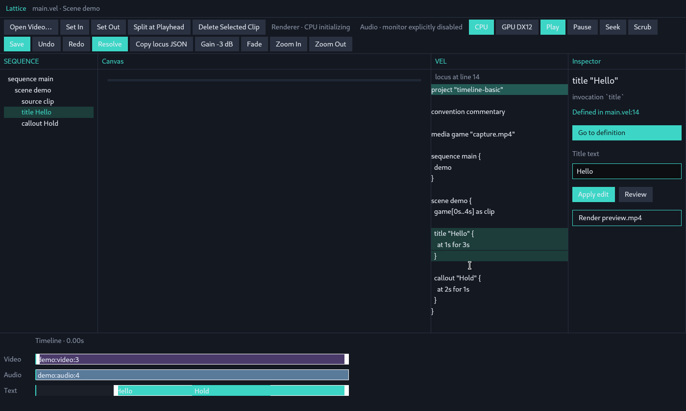
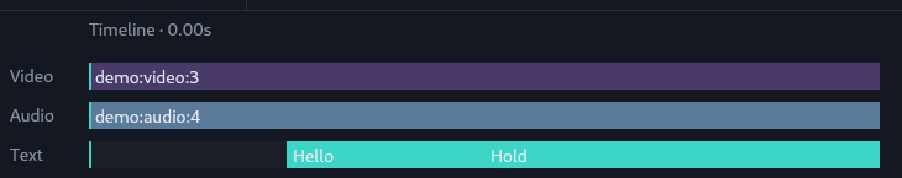
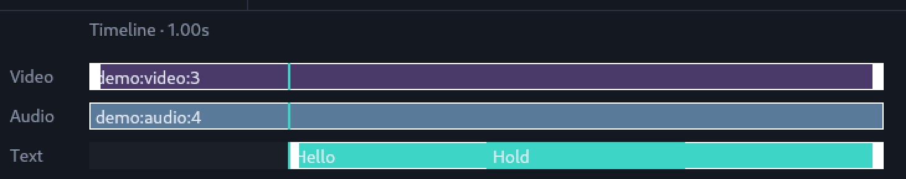
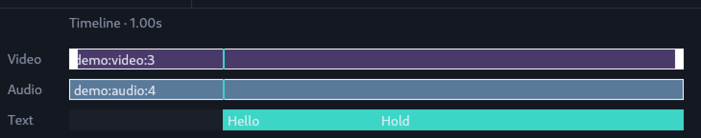
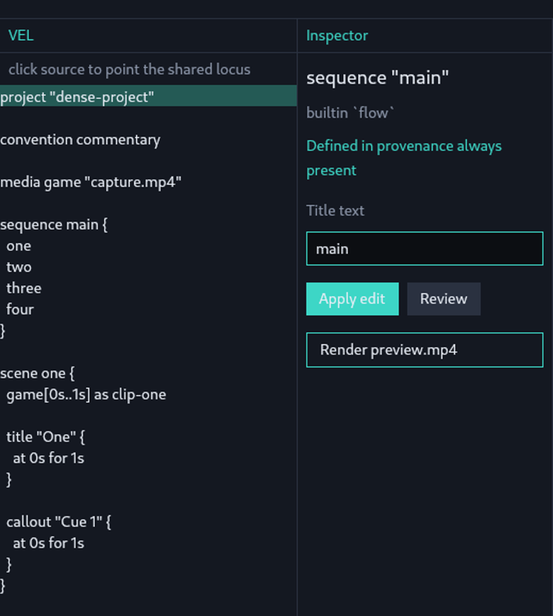
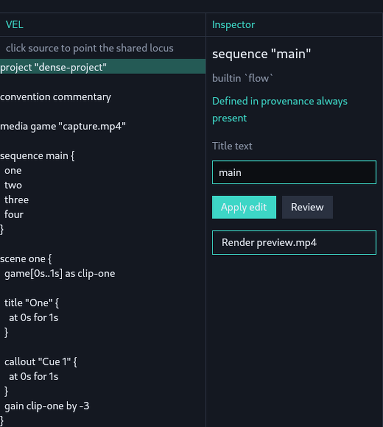
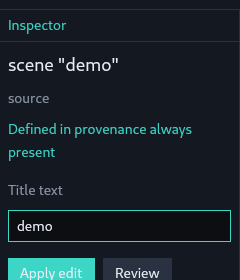
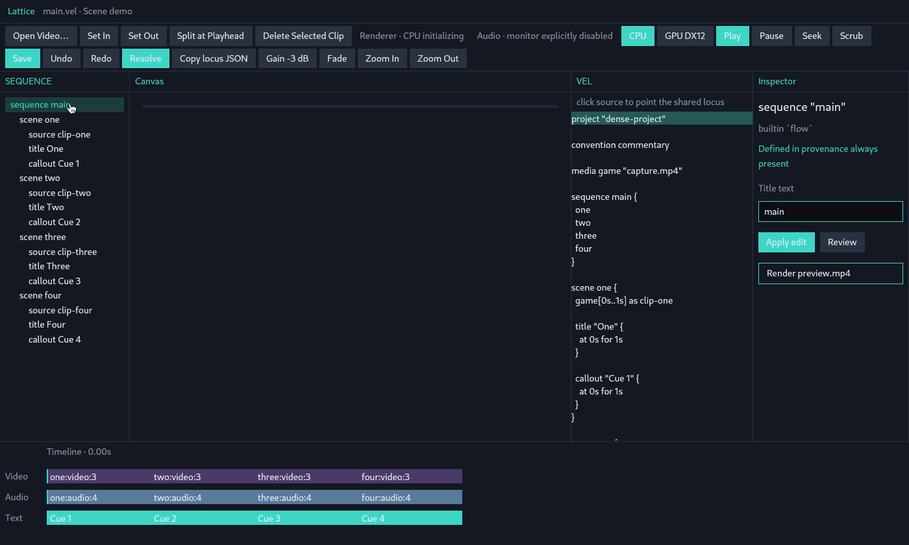
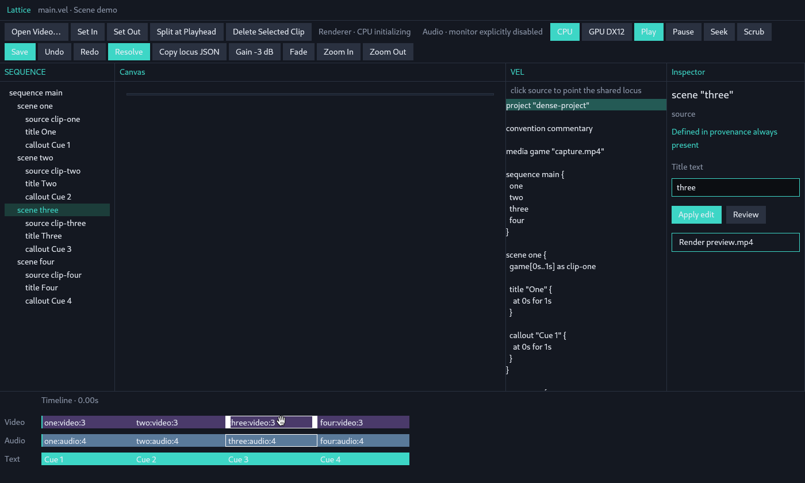

# Studio インタラクションの第一原理からの再構成

観測日: 2026-08-22
対象: `main` の `60ce42f` (`feat: complete the Alpha Studio A/V loop and DX12 renderer` / PR #2 マージ後)
種別: 観測と設計探索のノート。仕様ではない。`docs/principles.md` / `docs/architecture.md` / `docs/interaction.md` / `AGENTS.md` と衝突したら後者が勝つ。

Studio の UI コードは一行も変更していない。この文書は初期探索の境界を広げるためのもので、実装計画ではない。

---

## 0. この再構成が捨てた前提と守った前提

明示的に「決まっていないもの」として扱った前提:

- timeline が主 surface であること
- inspector が常設であること
- source / canvas / timeline が別ペインであること
- 編集が tool-mode 駆動であること
- 選択が従来の NLE 選択のように振る舞うこと

Premiere / Figma / IDE の慣習は「先例」として扱い、要件としては扱わない。

守った不変条件 (`AGENTS.md`, `docs/principles.md`):

- locus は共有の「ここ」であり、view ごとの選択モデルを作らない
- Studio は Engine のクライアントであり、コンパイル意味論を持たない
- GPUI 型は Core に漏れない
- FFmpeg はバックエンドであって意味モデルではない
- プロジェクト状態はテキスト先行で Git フレンドリー、プロジェクト DB を作らない
- Lattice に LLM SDK / エージェントランタイムを入れない。エージェントは外部
- magic は許すが hidden behavior は許さない
- 都合のために領域の意味論を歪めない

この文書の主張はすべて、上の不変条件と `lattice-core` の型そのものから導いている。

---

## 1. 観測: いま Studio が実際に投影しているもの

`60ce42f` を Linux X11 (`DISPLAY=:1`, lavapipe) で `scripts/studio-linux-smoke.sh --fixture timeline-basic` により起動して撮った実画面。生ログとウィジェット境界も同じディレクトリに置いてある
(`docs/artifacts/studio-interaction-2026-08-22-smoke.log`, `...-smoke-geom.json`)。

### 1.1 locus = `title "Hello"` の状態



### 1.2 locus = `scene "demo"` の状態（Video クリップと SEQUENCE の scene をクリックした後）


### 1.3 現行の投影表

`StudioView::render` は固定領域を組み立てる。`body` (`crates/lattice-studio/src/main.rs:2842-2858`) が `flex_row` で 4 ペインを並べ、その上下に header / toolbar / timeline が固定で乗る。タブもスプリッタもない。

| 領域 | render 関数 | 幅/高さ | Engine 由来 |
|---|---|---|---|
| header | `header_bar` | 36px | `file_label` + ハードコードされた `Scene demo` |
| toolbar | `actions_bar` (2417) | 折返し行 | 20 個のグローバルボタン |
| SEQUENCE | `tree_pane` (2861) | 200px 固定 | `Project.sequences` / `scenes` / `sources` + 一部 locus |
| Canvas | `canvas_pane` (2873) | flex | `RawFrame` (compositor) + `plan_from_timeline` の overlay 矩形 |
| VEL | `source_pane` (3036) | 280px 固定 | `Compilation.source` + `Locus.source_span` |
| Inspector | `inspector_pane` (3209) | 240px 固定 | `Locus.provenance` / `label` / `EditProposal` |
| Timeline | `timeline_bar` (3384) | 160px 固定, rail 640px (`TIMELINE_WIDTH` 3932) | `flatten_project` → `plan_from_timeline` |

投影レイヤは `crates/lattice-studio/src/layout.rs` の `from_session` (108) に集約されていて、GPUI 型を含まない。ここは設計として正しい。問題はペインの割り方そのもの。

---

## 2. ドメイン型が実際に言っていること

以下は `lattice-core` の型から直接読める事実で、UI の好みではない。

### D1. locus は単数、投影は複数

`Locus` (`crates/lattice-core/src/locus.rs:60-78`) は単一の値。`LocusId` は 1 個。
一方 `docs/interaction.md:10` は「ひとつの source 定義が多数の rendered instance に投影されうる。locus は意味であって特定の矩形ではない」と言う。

これは従来の NLE 選択の**正反対**である。NLE の選択は「クリップの集合」で、各クリップは 1 つの見た目を持つ。Lattice の選択は「1 つの意味」で、それが複数の見た目を持つ。

しかもこれは既に実測できる。`crates/lattice-studio/src/layout.rs:368-378` の `selected` 判定:

```rust
let selected = current.is_some_and(|locus| {
    if overlay {
        return locus.id.as_str() == clip.id || locus.node_id == clip.id;
    }
    locus.id.as_str() == clip.id
        || locus.node_id == clip.id
        || locus.scene_id.as_deref() == Some(scene_id.as_str())
        || current_id.as_ref().is_some_and(|id| id.as_str() == scene_id)
});
```

`timeline-basic` fixture で実測したハイライト数。選択は `track_row` の
`border_color(if selected { 0xffffff } else { color })` による白枠なので、キャプチャのピクセルから数えられる
(計測出力: `docs/artifacts/studio-selection-2026-08-22-clip-count.txt`)。

| current locus | 白枠になる timeline clip 数 | 内訳 |
|---|---|---|
| `sequence:main` (Sequence) | 0 | `scene_id` が `None` なのでどの clip にも一致しない |
| `demo:title:1` (Title) | 3 | video, audio (scene 一致), title (id 一致)。callout は外れる |
| `scene:demo` (Scene) | 2 | video, audio。overlay は早期 return で外れる |

基準 (Sequence locus, 0 個):



Title locus (3 個: Video と Audio と title `Hello`。白枠は重なった `Hold` callout で途切れており、その callout 自身は白枠を持たない):



Scene locus (2 個: Video と Audio のみ。title も callout も白枠なし):



つまり「1 locus → N 個の見た目」はもう起きている。ただし N の決まり方が track ごとに違い、その規則はどこにも表示されていない。

**導出:** ハイライトは本質的に複数形である。「選択された矩形」はカテゴリの取り違えであり、単数の選択ハンドルを前提にした UI はこの領域に合わない。

### D2. ペインの正体は `LocusProjection` のフィールドである

`crates/lattice-core/src/locus.rs:96-119`:

```rust
pub struct LocusProjection {
    pub locus: Locus,
    pub source: Option<SourceProjection>,   // Span
    pub core: CoreProjection,               // node_id + kind
    pub timeline: Option<TimelineProjection>, // clip_id + TimeSpan
}
```

`Locus` 自身が持つ facet も列挙可能: `source_span: Option<Span>`, `timeline_span: Option<TimeSpan>`, `visual: Option<VisualProjection>`, `provenance: Provenance`, `scene_id` / `sequence_id`, `derived_from: Option<LocusId>`。

つまり「どんな view が存在しうるか」はデザイナの選択ではなく、型のフィールド集合である。そして `Option` であることが重要:

| LocusKind | source_span | timeline_span | visual |
|---|---|---|---|
| Media | なし | なし | なし |
| Sequence | なし | なし | なし |
| Scene | なし | なし | なし |
| Source | あり | なし | なし |
| Placement | あり | あり | 場合により |
| Title / Callout | あり | あり | あり |
| Speech | あり | あり | なし |

(`crates/lattice-engine/src/locus.rs:13-137` の `loci_from_project` がこれを構築している。)

現行 UI は body の 4 ペインと timeline を locus に関わらず常に描く。`Media` locus を指しているとき、canvas overlay / VEL ハイライト / timeline span はすべて空の affordance になる。逆に `Title` locus では facet が全部揃う。

**導出:** ペイン数は固定ではなく、facet の有無から導かれるべき値である。

### D3. `specificity()` は梯子である

`crates/lattice-core/src/locus.rs:146-154`:

```rust
pub fn specificity(&self) -> u8 {
    match self.kind {
        LocusKind::Title | LocusKind::Callout | LocusKind::Speech => 4,
        LocusKind::Source => 3,
        LocusKind::Placement => 2,
        LocusKind::Scene => 1,
        LocusKind::Sequence | LocusKind::Media => 0,
    }
}
```

これに `scene_id` / `sequence_id` の包含関係と `derived_from` の派生関係が加わる。つまりドメインは既に locus の**束**を持っている: 包含 (sequence ⊃ scene ⊃ placement) と派生 (placement ← source)。

現行の Engine はこれを `Vec<Locus>` に平坦化して `max_by_key((specificity, 1/span))` で勝者 1 つを選ぶ (`crates/lattice-engine/src/locus.rs:153-173`)。曖昧性解消には正しいが、**構造そのものは捨てている**。

`derived_from` は `loci_from_project` で埋められるが、`lattice-studio` からは一度も読まれない。

**導出:** 「ここを動かす」は座標移動ではなく梯子の traversal (上下 = 包含、横 = 兄弟、斜め = 派生) である。ツリーペインはこの束の一射影にすぎず、しかも派生の軸を描いていない。

### D4. Timeline は文書ではなく純関数の派生物

`crates/lattice-core/src/timeline.rs:10-15`:

```rust
/// Flattened editorial timeline. Pure function of compiled Core IR.
pub struct Timeline { pub duration: Time, pub clips: Vec<TimelineClip> }
```

`flatten_project` は `Project` → `Timeline` の写像で、逆写像は存在しない。Studio の timeline ジェスチャはすべて `SemanticEdit` → VEL 書き換え → 再コンパイル を経由する
(`crates/lattice-studio/src/interaction.rs` の `apply_committed`)。

**導出:** timeline は編集の作業面ではなく、「押すと上流に伝播するボタンが付いた読み出し」である。それを主 surface に置くのは、最も派生した成果物を主役にする依存関係の反転になる。慣習では timeline が主なのは、慣習的 NLE では timeline が**文書そのもの**だから。Lattice では文書は VEL テキストである。

### D5. `TimeMap` は前方向のみ。よって「今」は数ではなく組

`crates/lattice-core/src/time_map.rs:6-34` は `TimeMapSegment { local_start, local_duration, content_start, rate }` を持ち、`rate` は「local 差分あたりの content 差分。`0` は freeze、`1` は 1x、`-1` は逆再生」。

`content_at(local)` (`time_map.rs:49-71`) は前方写像のみ。`local_at(content)` は存在しない。freeze 中は多数の local 時刻が同一 content 時刻に写るので、逆写像は原理的に関数にならない。

Studio における現状:

- `lattice-studio/src` に `TimeMap` / `content_at` / `content_time` の参照は 0 件
- `map_timeline_to_source` は `playhead_source_time` (`crates/lattice-studio/src/session.rs:1224-1229`) の中だけで使われ、Split / Trim の `at:` 引数を計算して**捨てられる**。ユーザには一度も表示されない
- `Timeline::freeze_segments()` (`crates/lattice-core/src/timeline.rs:147`) は engine のテストからのみ呼ばれる。Studio はツリーに `freeze` という葉ラベルを出すために `source.time_map.segments` の `rate.num() == 0` を自前で走査する (`layout.rs:178-191`) が、時刻情報は付かない

`examples/gameplay-commentary/main.vel` は `freeze fight at 5.2s for 1.5s` を含む。この 1.5 秒間、playhead は動くが content 時刻は動かない。現行 UI ではそれが不可視。

**導出:** 単一のスクラブ軸は frozen material に対して嘘をつく。正直な読み出しは `(local, content, rate)` の 3 つ組であり、freeze はプラトーとして見えるべき。そして `content_at` に逆がないので、「content 時刻をスクラブする」操作は**提供してはいけない**。これは UI の好みではなく代数からの禁止。

### D6. `SemanticEdit` は閉じた 10 変種で、合法性は locus 種別で決まる

`crates/lattice-core/src/edit.rs:24-73`: `Title` / `Trim` / `Split` / `Delete` / `SetGain` / `SetFade` / `ReorderScene` / `Callout` / `SetPosition` / `ResizeOverlay`。
それぞれ `describe()` (`edit.rs:115`) で人間可読文を持ち、`is_empty()` で no-op 判定を持つ。

そして合法性の表は既にコードとして存在する。`crates/lattice-studio/src/session.rs:1101-1170` の `target_locus_for`:

| SemanticEdit | 受け付ける locus |
|---|---|
| `Title` | Title / Scene / Source |
| `Trim` | Source |
| `Split` / `Delete` / `ReorderScene` | Scene |
| `SetGain` / `SetFade` | Source、なければ Scene |
| `Callout` | Callout のみ |
| `SetPosition` / `ResizeOverlay` | visual を持つ overlay |

さらに各変種のパラメータは全部型付き: `Time`, `Option<Time>`, `NormalizedPosition`, `NormalizedScale`, `i32` (dB), `Option<String>` (before), `u8` (opacity)。

**導出:** tool mode は存在しない。動詞集合は有限で、locus 種別ごとに合法部分集合が決まり、パラメータの型がジェスチャを決める (`Time` → スクラブ、`NormalizedPosition` → ドラッグ、`i32` dB → ダイヤル)。つまり自然な形は「動詞 → 対象」ではなく「locus → 合法な動詞」。

### D7. `Origin` は 4 つの異なる「存在様式」

`crates/lattice-core/src/provenance.rs:7-12`:

```rust
pub enum Origin { Source, Invocation { command }, Convention { name }, Builtin { name } }
```

これは 4 つのラベルではなく、4 つの異なる編集可能性である:

| Origin | 「これを編集する」の意味 | source span |
|---|---|---|
| `Source` | 自分が書いたテキストを直す | あり |
| `Invocation { command }` | invocation の引数を変える | あり |
| `Convention { name }` | **テキストに直す対象が存在しない**。既定値を見ている | `Provenance::convention` は `span: None` (`provenance.rs:37-42`) |
| `Builtin { name }` | 構造 (`flow` の scene 順など) | なし |

現行 Inspector はこの 4 分岐を 1 本の文字列に潰す (`layout.rs:323-328`)。span がない locus では "Go to definition" ボタンが消え、代わりにプレースホルダ文字列が file:line の位置に描かれる。

**導出:** convention 由来の locus には固有の affordance (「この既定値をテキストに実体化する」) が必要になる。それがないと、`docs/principles.md` の「magic は許すが hidden behavior は許さない」に反する行き止まりになる。

### D8. 可変状態は VEL 文字列ひとつだけ

`StudioSession` の undo/redo は VEL source の文字列スタック。`EditProposal` は `new_source` を丸ごと持つ (`crates/lattice-core/src/edit.rs:80-89`) し、`base_revision` は source バイト列の FNV-1a。compile は純粋関数。

つまり「commit したらどうなるか」を任意のジェスチャについて**先に**計算できる。これは既に `propose()` が返してくれる。

現行はこの対称性を使っていない。エージェント経路 (`propose_title_text` → Review → Apply) では提案を見せるのに、直接操作 (timeline ドラッグ / canvas ドラッグ) は commit してから失敗しうる。失敗は `session.last_gesture_error` に入り、`crates/lattice-studio/src/main.rs:1607-1609` で trace ログに書かれるだけで、画面には出ない。

**導出:** 編集経路は 1 本であるべき。Review は「エージェント経路」ではなく唯一の経路で、コストがゼロのときは軽く描かれるだけ。

---

## 3. 不変条件違反として観測されたもの

「hidden behavior は許さない」に照らして、コードから確認できたもの。すべて `60ce42f` で再現する。

### H1. ツールバーの動詞は locus を見ていない

`target_locus_for` が対象を見つけられないとき、`target_scene_locus` は最終的に**プロジェクト内で最初に見つかった scene locus** を返す (`crates/lattice-studio/src/session.rs:1200-1201`)。`target_source_locus` は同様に**最初の source locus** を返す (`session.rs:1219-1221`)。

`Title` 編集は Title/Scene/Source 以外の locus でも `scene_id` があれば `target_scene_locus()` に落ちる (`session.rs:1115-1117`)。`SetGain` / `SetFade` は source を試して scene に落ちる (`session.rs:1126-1128`)。

実測。`dense-project` fixture (4 scene、source は `clip-one` .. `clip-four`) で `sequence main` を指した状態、
つまり `LocusKind::Sequence` / `scene_id: None` / source ではない locus で `Gain -3 dB` を押す。

押す前 (locus は `sequence "main"`、origin は `builtin 'flow'`、`scene one` に gain 行はない):



押した後。locus は `sequence "main"` のまま動かず、`gain clip-one by -3` が
**プロジェクト最初の source** である `scene one` の `clip-one` に着地している:



全画面版は `studio-toolbar-2026-08-22-before-gain-sequence-locus.png` と
`...-after-gain-first-source.png`。ログは `studio-toolbar-2026-08-22-smoke.log`。

ツールバーの 20 ボタンは常に有効に描かれ、合法性は commit 時に発見される。グローバル動詞ツールバーは locus モデルと構造的に相性が悪い。グローバル動詞は対象を要求し、locus が対象を供給できないとコードが対象を**発明する**。

### H2. `explain` が一度も表示されない

`ExplainEvent { origin, message }` は compile 時に生成され `Compilation.explain` に入る (`crates/lattice-engine/src/compile.rs:53-68`)。
`rg explain crates/lattice-studio/src/` は 0 件。

`docs/principles.md` は「すべての magic 展開は explain 可能でなければならない」と言う。CLI では満たされている。Studio では満たされていない。

### H3. diagnostics が一度も表示されない

`Compilation.diagnostics` / `Compilation.has_errors()` は存在し、`session.diagnostics()` (`session.rs:123`) も公開されている。描画箇所は 0。open 時に件数だけ trace ログに出る (`main.rs:309-312`)。

つまり Studio はエラー状態のまま、画面上に何の指示も出さずに動作しうる。

### H4. content 時刻が計算されて捨てられる

D5 の通り。`map_timeline_to_source` は Split / Trim のたびに呼ばれ、結果は引数計算に使われて破棄される。

### H5. clamp が黙って効く

`NormalizedScale::clamped` (`crates/lattice-core/src/space.rs:35-42`)、`NormalizedScale::fit_within` (`space.rs:50-73`)、`NormalizedPosition::clamped` (`space.rs:114-120`)、`NormalizedPosition::pixel_origin` (`space.rs:133-148`) はいずれも `Self` / タプルを返し、「clamp した」というシグナルを返さない。

overlay スケールは 25%..200% (`OVERLAY_SCALE_MIN` / `MAX`) に固定され、さらに canvas に収まるよう `fit_within` で切られる。ユーザはドラッグし、結果は無言で丸められる。

### H6. provenance を持たない locus の行き止まり

`inspector_from_locus` (`layout.rs:319-322`):

```rust
let defined_in = locus.source_span.map_or_else(
    || "provenance always present".into(),
    |span| format!("{file}:{}", span.line),
);
```

Scene locus は `loci_from_project` で `source_span: None` を受ける (`crates/lattice-engine/src/locus.rs:59-75`)。結果、`Defined in` の位置にプレースホルダ文が描かれる。実測:



`Defined in provenance always present` は file:line の位置に置かれた文であって、provenance ではない。同時に "Go to definition" ボタンは説明なく消える。

### H7. Video クリップのクリックは clip_id を捨てる

`crates/lattice-studio/src/interaction.rs:214-215`:

```rust
point_scene(session, &scene_id);
let _ = clip_id;
```

Trim / Reorder ジェスチャは scene を指す。overlay ジェスチャは `point_clip` で clip を指す (`interaction.rs:266`, `285`)。つまり timeline のクリックが返す locus の粒度が track ごとに違い、その規則は表示されない。

実測。`dense-project` で `sequence main` を指した状態から Video track の 3 番目の clip (`three:video:3`) をクリックする。

クリック前 (locus は `sequence "main"`):



クリック後。locus は `three:video:3` でも `source:clip-three` でもなく `scene "three"` になる。
SEQUENCE ツリーのハイライトも `scene three` に付き、Inspector の見出しも `scene "three"`:



`semantic_state` でも同じ遷移が出る (`docs/artifacts/studio-videoclick-2026-08-22-smoke.log`):

```text
timeline-pointer-begin  -> sequence sequence:main main
timeline-pointer-commit -> scene    scene:three   three
```

この後画面は claim「1 Scene locus → 2 clip」も同時に再現していて、16 clip のうち
`three:video:3` と `three:audio:4` だけが白枠になり、`title Three` と `Cue 3` は白枠を持たない。

### H8. Inspector の Title text が locus ラベルを吸い込む

`adopt_locus_label` (`crates/lattice-studio/src/main.rs:1094-1101`) は locus 種別を問わず `self.title_draft = locus.label;` を実行する。locus を移すと Inspector の `Title text` フィールドが locus の `label` を取り込む。Scene locus に移ると、そこには scene 名 `demo` が入る (§1.2 のスクリーンショット)。この状態で `Apply edit` を押すと `SemanticEdit::Title { text: "demo" }` が `target_locus_for` 経由で scene に着地する。scene 名をタイトル文字列として書き込む提案が、無言で用意されている。

---

## 4. 再構成: ペインより前に決まる 8 つのプリミティブ

レイアウトを一切決めずに、ドメインから導ける「必ず存在するもの」だけを並べる。どれも「ペイン」ではない。

| # | プリミティブ | 型の根拠 | 単数/複数 |
|---|---|---|---|
| P1 | **Here** — ひとつの `LocusId` | `Locus.id` | 単数 |
| P2 | **Facets** — その locus に存在する投影 | `LocusProjection` の `Option` フィールド + `Locus.visual` | 原理的に複数 (現状は Option) |
| P3 | **Ladder** — 包含と派生の束 | `specificity()` + `scene_id`/`sequence_id` + `derived_from` | グラフ |
| P4 | **Verbs** — この locus で合法な `SemanticEdit` 部分集合 | `SemanticEdit` 10 変種 + `target_locus_for` の表 | 有限集合 |
| P5 | **Why** — 4 通りの存在様式と explain | `Origin` + `ExplainEvent` | 単数 + 複数 |
| P6 | **Now** — `(local, content, rate)` | `TimeMap.segments` | 3 つ組 |
| P7 | **Truth** — `Now` における合成フレーム | `evaluate_at` → `RenderScene` | 単数 |
| P8 | **Health** — この locus に帰属する diagnostics | `Diagnostic.span` ⊂ `Locus.source_span` | 複数 |

現行 Studio はこのうち P1, P2, P7 を部分的に覆い、P3 を平坦化し、P4 を暗黙にし、P5 を 1 文字列に潰し、P6 を 1 つの数に潰し、P8 を不可視にしている。

---

## 5. 探索空間を 3 つの直交軸に開く

以下は競合案ではない。**直交する 3 軸**で、現行 Studio はその一隅に座っている。

```text
軸A  どこに何があるか        固定ペイン       ←→  facet 適応の単一面
軸B  変更はいつ実在するか    commit-then-fail ←→ 提案が常に先
軸C  変更をどう表現するか    グローバル動詞ツールバー ←→ locus 由来の合法動詞
現行 = (固定ペイン, commit-then-fail, グローバルツールバー)
```

### 軸 A: Locus Sheet — facet 適応の単一面

**導出。** D2 より、view の種類は `LocusProjection` のフィールドである。D3 より、locus は梯子を成す。この 2 つを合わせると、**全体 timeline は「ペイン」ではなく Sequence locus の timeline facet** になり、**canvas は Title locus の visual facet あるいは Scene locus の render facet** になり、**VEL テキストは source facet** になる。全部が同じ機構の、梯子の違う段での姿になる。

そうすると:

- `Media` locus を指しているとき、空の canvas と空の timeline span は描かれない。存在する facet (名前と `MediaLocator`) だけが描かれる
- 「プロジェクト全体を見る」は視点の切り替えではなく、梯子を Sequence まで上がる操作になる
- 常に見えているのは梯子の背骨 (現在位置 + 兄弟 + 親 + 派生元) で、これは `scene_id` / `sequence_id` / `derived_from` から導ける

**買えるもの。** 空の affordance が消える。「4 つの窓のどれを見ればいいか」という問いが消える。派生の軸 (`derived_from`) が初めて可視になる。

**代償。** 同時俯瞰を失う。編集中に全体の尺を見たいという要求は実在する。緩和は梯子の背骨を常設にすることだが、それは「inspector 常設をやめる」代わりに別の常設を作ることでもあり、正直に代償として記録しておく。

**既存の型でどこまで行けるか。** ほぼ行ける。ただし `Locus.timeline_span` が Scene / Sequence では `None` なので (`crates/lattice-engine/src/locus.rs:59-75`, `32-52`)、「Sequence locus の timeline facet」は今の型では空になる。§7 の G1。

### 軸 B: Proposal-first — 提案が第一級で、直接操作は提案の著者

**導出。** D8 より、可変状態は VEL 文字列 1 つで、`propose()` は純粋かつ安価で、`EditProposal` は description / vel_diff / new_source / base_revision を持つ。つまり「commit したらどうなるか」は任意のジェスチャについて先に計算できる。

`docs/interaction.md:79` は既に「pointer up → commit: 1 SemanticEdit → 1 VEL rewrite → 1 compile → 1 Undo」と言っている。提案を先に置くと、これがそのまま「1 提案 → 1 適用」になる。

そうすると:

- Review はエージェント専用経路ではなくなる。すべての編集が提案を通り、安いものは提案が一瞬だけ「これから起きること」として見えるだけ
- H1 (無言の retarget) が構造的に不可能になる。提案は `locus_id` を持つので、着地点が意味として表示される
- 失敗が commit 後ではなく commit 前に見える。`last_gesture_error` を trace ログに捨てる必要がなくなる
- 「意味 (`describe()`) / 絵 (`new_source` を `Now` で evaluate) / ソース (`vel_diff`)」の 3 つ組が、エージェント提案と手ドラッグで同じ形になる

**買えるもの。** 編集経路が 1 本になる。エージェントと人間が同じ器を使う。`base_revision` による stale 検出が全経路で効く。

**代償。** すべてのドラッグに儀式が付くリスク。緩和は提案を modal にしないこと (常設の「これから起きること」帯にする) だが、ドラッグ中に毎フレーム `propose()` + `compile()` + `evaluate_at()` を回すコストは実測が必要。ここは未検証。

**既存の型でどこまで行けるか。** `propose` / `apply_proposal` / `reject_proposal` / `base_revision` は全部ある。足りないのは「今の locus で合法な編集の一覧」を返すクエリ。§7 の G2。

### 軸 C: Verb-first — 合法動詞を投影し、ジェスチャをパラメータ型から導く

**導出。** D6 より、`SemanticEdit` は閉じた 10 変種で、合法性表は `target_locus_for` として既に書かれており、パラメータは全部 Core の型である。

そうすると:

- 「動詞 → 対象」ではなく「locus → 合法な動詞」。ツールバーではなく locus 由来のコマンド集合
- ジェスチャ語彙は**パラメータ型の関数**になる。`Time` → 時間軸上のドラッグ、`NormalizedPosition` → canvas 上のドラッグ、`NormalizedScale` → コーナー、`i32` dB → 数値、`Option<String> before` → 順序入替。パラメータエディタは Core の型 5 種類ぶんで足りる
- `SemanticEdit` に変種を足すと、そのジェスチャが自動的に決まる。手書きの per-pane マウスハンドラ (現状 `main.rs` の大部分) が語彙とずれる余地がなくなる
- 合法でない動詞は表示されない。H1 の「無言の retarget」を必要とする状況自体が発生しない

**買えるもの。** 動詞集合とジェスチャ集合が構造的に同期する。tool mode が不要になる。合法性が発見ではなく開示になる。

**代償。** 直接操作の直感を、型駆動の affordance に翻訳しきれない箇所が出る。特に `ReorderScene { before: Option<String> }` は「名前による順序指定」であって空間的なドラッグと素直に対応しない。ここは型の側が編集意図を表しきれていない可能性がある (`before` が scene 名の文字列である点を含む)。

**既存の型でどこまで行けるか。** 合法性表は Studio の `session.rs` に埋まっていて Engine 側にない。CLI と Studio が同じ表を共有するには Engine に上げる必要がある。§7 の G2。

### 3 軸の独立性

A は「どこにあるか」、B は「いつ実在するか」、C は「どう表現するか」で、互いに独立に選べる。例えば「固定ペイン × 提案先行 × 合法動詞」も「単一面 × commit-then-fail × ツールバー」も成立する。この文書の主張は特定の一点を推すことではなく、現行が一隅にいることと、他の 7 隅が未探索であることを示すことにある。

---

## 6. どの案でも必要になる正直な読み出し

軸の選択に関わらず、不変条件から要求されるもの。

| # | 読み出し | 根拠 |
|---|---|---|
| R1 | `(local, content, rate)` の 3 つ組。freeze はプラトーとして見える | D5 / H4 |
| R2 | diagnostics が常に見える。エラー状態が不可視にならない | H3 |
| R3 | explain がこの locus に対して見える | H2 |
| R4 | clamp が起きたら開示される | H5 |
| R5 | source span を持たない locus は「なぜ持たないか」を言う (convention 既定値なのか、構造なのか) | D7 / H6 |
| R6 | ハイライトは複数形で、その規則が言語化されている | D1 |
| R7 | 編集の着地点が locus として表示され、無言の retarget が存在しない | H1 |

R1..R7 はすべて「magic は許すが hidden behavior は許さない」の帰結であり、UI の趣味ではない。

---

## 7. Core / Engine 側の型の穴

実装はしない。名前を付けるだけ。どれも上の再構成のどこかで詰まる箇所。

| # | 穴 | 現状 | 詰まる場所 |
|---|---|---|---|
| G1 | `Locus.timeline_span: Option<TimeSpan>` が単数で、Scene / Sequence では `None` | `crates/lattice-core/src/locus.rs:72`, `crates/lattice-engine/src/locus.rs:32-75` | 軸 A の「Sequence locus の timeline facet」。および D1 の「1 定義 → N instance」を型が表現できない (`TimelineProjection` も `clip_id` 単数) |
| G2 | 「この locus で合法な編集」を返す Engine クエリがない | 合法性表は `crates/lattice-studio/src/session.rs:1101-1170` に埋まっている | 軸 C 全体。CLI と Studio が別の表を持つ危険 |
| G3 | `ExplainEvent { origin, message }` に span も locus_id もない | `crates/lattice-engine/src/compile.rs:53-57` | R3。explain を「ここ」に絞れない |
| G4 | `TimeMap` に逆写像がない | `crates/lattice-core/src/time_map.rs` に `local_at` はない | これは穴ではなく**制約**。content 時刻のスクラブを提供してはいけない根拠として記録する |
| G5 | `derived_from` が誰にも読まれていない | `crates/lattice-engine/src/locus.rs:124-127` が埋め、`lattice-studio` は参照しない | 軸 A の派生軸 traversal |
| G6 | clamp が「clamp した」を返さない | `crates/lattice-core/src/space.rs:35-42`, `50-73`, `114-120`, `133-148` | R4 |
| G7 | `Diagnostic` → locus の帰属が span 包含の間接参照のみ | `crates/lattice-core/src/diagnostic.rs` | R2 / P8 |
| G8 | convention 由来ノードを「テキストに実体化する」編集が `SemanticEdit` にない | `Provenance::convention` は `span: None` (`crates/lattice-core/src/provenance.rs:37-42`) | D7 / R5 の行き止まり解消 |

G1 と G8 は Core の型変更を含むので、`AGENTS.md` の検証規約 (Core の時間 / TimeMap 代数を触ったらユニットテスト、VEL 構文を触ったらパーサテストと golden 更新) に直接かかる。

---

## 8. 反証可能なチェック

次に実装へ進む場合、以下は「良くなった気がする」ではなく機械的に判定できる。

1. 任意の locus について、描かれる facet 数 == その locus の non-`None` な投影フィールド数
2. 任意の locus について、押せる動詞集合 == `propose()` が `Ok` を返す `SemanticEdit` 変種集合。差が 0
3. `target_scene_locus` / `target_source_locus` の「プロジェクト先頭にフォールバック」経路の到達回数が 0
4. `freeze` を含むプロジェクトで、freeze 区間内の 2 点で content 時刻の表示が一致する
5. `Compilation.diagnostics` が非空なら、画面上に対応する表示が存在する
6. `Compilation.explain` の各イベントが、少なくとも 1 つの locus から辿れる
7. `fit_within` / `clamped` が入力を変えたケースで、その旨の表示が存在する
8. ある locus に対するハイライト対象の集合が、`layout.rs` の暗黙規則ではなく 1 箇所に定義された関係から導かれている

3, 5, 6 は現状 `60ce42f` で失敗する。1, 2, 4, 7, 8 は現状そもそも測れない。

---

## 9. 非目標

- この文書は UI の実装計画ではない。`60ce42f` で Studio コードは変更していない
- GPUI のレイアウト、配色、コンポーネント設計には触れない
- Milestone 0 のスコープ (`AGENTS.md`) を広げる提案ではない。OTIO / TTS プロバイダ / GPU レンダラ / Timeline UI の着手を勧めていない
- エージェントランタイムや LLM SDK をリポジトリに入れる案は含まない。Studio の役割は locus の供給元と提案の審査場であって、エージェントの宿主ではない
- `docs/mockups/studio/` のボードを否定するものではない。あのボードは軸 B / 軸 C の一部 (Review の 3 つ組、provenance 常在) を既に凍結している。この文書はその外側の未探索領域を記述している
