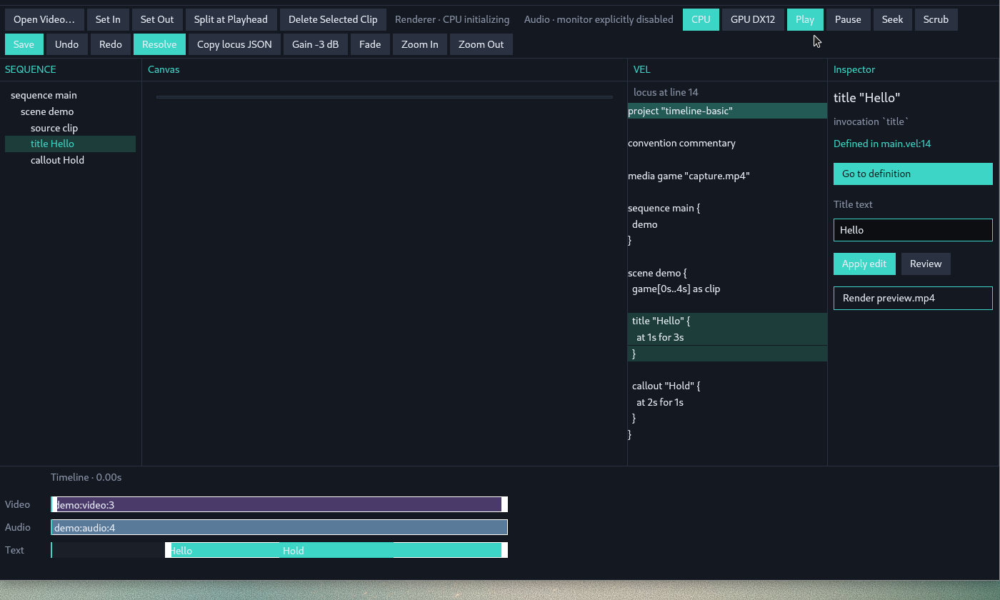
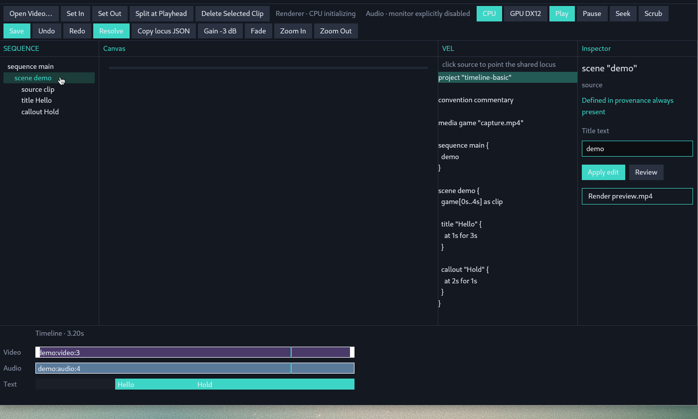

# Studio observation — structure, ownership, constraints

Observed at `main` `60ce42f51ce64c3db05ce693b1605b249828038e` (PR #2 `feat/alpha-studio`). This is an implementation report, not a UI proposal. No Studio UI code was changed.

Screenshots below are the Linux `--ui-fixture timeline-basic` window already recorded against this Alpha shell (`docs/screenshots/chi64-open-window.png`, `docs/screenshots/chi67-this-head-after.png`). They show the current chrome, not a target layout.

## What is already real

Studio is a GPUI client of `lattice-engine`. Compile / locus / rewrite / resolve / evaluate live in Engine + Core. The window holds a session and paints a projection of that session.

The Alpha shell is one window, one session, one `LocusId`. SEQUENCE, Canvas, VEL, Timeline, Inspector, Review, and "Copy locus JSON" all point at that id. Playhead is editor clock, not a locus.

Linux is an enabling smoke target only. Product dogfood is Windows 11 x64 (DX12 + default-output audio). See `docs/studio-linux-smoke.md` and `README.md`.

---

## 1. Current component structure

### Crates and files

`lattice-studio` is the only Studio crate. There is no `lattice-client` crate. CLI is a sibling Engine client (`lattice-cli`), not a Studio dependency.

| Path | Role | GPUI? |
|---|---|---|
| `crates/lattice-studio/src/session.rs` — `StudioSession` | Open / compile / locus / edits / undo / playhead / viewport / preview mailbox | no |
| `crates/lattice-studio/src/layout.rs` — `StudioLayout` | Pane DTOs derived from Engine compile + timeline + plan + loci | no |
| `crates/lattice-studio/src/interaction.rs` | Timeline begin / update / commit / cancel | no |
| `crates/lattice-studio/src/gesture.rs` — `TimelineGesture` | Hit-test, snap, ephemeral trim/reorder/overlay spans | no |
| `crates/lattice-studio/src/canvas.rs` — `CanvasDrag`, `CanvasResize` | Pixel → normalized Canvas Space; commit is `SemanticEdit` | no |
| `crates/lattice-studio/src/viewport.rs` — `TimelineViewport` | Time ↔ rail x | no |
| `crates/lattice-studio/src/preview.rs` — `PreviewMailbox`, `PreviewInbox` | Generation coalescing; stills, not a streaming decoder | no |
| `crates/lattice-studio/src/semantic_state.rs` | Agent/smoke JSON over existing session fields | no |
| `crates/lattice-studio/src/ui_fixture.rs` — `UiFixture` | Named VEL fixtures materialized through `StudioSession::open` | no |
| `crates/lattice-studio/src/audio.rs` — `AudioMonitor` | Device transport + drift; CPAL is Windows-only | no (CPAL types stay here) |
| `crates/lattice-studio/src/trace.rs` | Durable log; no `println!` (Windows pipe panic) | no |
| `crates/lattice-studio/src/main.rs` — `StudioView` | Entire GPUI shell (~3900 lines, one file) | yes |
| `crates/lattice-studio/src/ui_driver.rs` — `UiDriver` | `VisualTestContext` + `debug_selector` dispatch | yes (tests) |

`lib.rs` re-exports session / layout / gesture / preview and keeps `canvas` / `session` / `layout` private-to-crate except the public types. Binary requires `--features window` (default).

Engine surface Studio actually calls: `Engine::compile_path` / `compile_origin`, `Engine::loci` / `inspect` / `locus_at_source` / `locus_at_timeline`, `Engine::propose` / `apply_proposal` / `reject_proposal`, `Engine::timeline`, `plan_from_timeline`, `preview_frame` / `render_with_options`, `Engine::resolve` + `LocalToneProvider`, `import_media`. Defined in `crates/lattice-engine/src/compile.rs` and re-exported from `crates/lattice-engine/src/lib.rs`.

Core nouns: `Locus` / `LocusId` / `LocusKind` / `LocusProjection` (`lattice-core/src/locus.rs`), `SemanticEdit` / `EditProposal` (`lattice-core/src/edit.rs`). Engine projects loci in `lattice-engine/src/locus.rs` (`loci_from_project`, `locus_at_source`, `locus_at_timeline`).

### Window composition (what is painted)

`StudioView::render` (`main.rs`) is a column:

1. `header_bar` — brand + `{file} · Scene demo` (the scene name is a literal, not `StudioLayout`)
2. `actions_bar` — one wrapping button row (two visual rows at current width)
3. `body` — four siblings: SEQUENCE (`tree_pane`) / Canvas / VEL (`source_pane`) / Inspector
4. `timeline_bar` — ruler + Video / Audio / Text rails

`body` does not dock, split, or persist pane sizes. SEQUENCE is fixed `px(200)`, Inspector `px(240)`, Canvas and VEL are `flex_1`. Timeline is always the bottom strip.

`StudioLayout` panes (`layout.rs`):

- `tree: Vec<TreeNode>` — sequence → scene → source / title / callout / speech; synthetic `freeze:{source.id}` children
- `canvas: CanvasView` — overlays bound by `locus_id`, plus optional cached preview path
- `source: SourceView` — full VEL text + optional highlight `Span`
- `inspector: InspectorView` — heading / origin / defined_in / `go_to_definition`
- `timeline: TimelineView` — three named tracks, snap/insertion markers, viewport window
- `review: Option<ReviewView>` — description + `vel_diff` + `locus_id` (no proposal picture)

Canvas chrome is selection only. `layout.rs` tests and `window_source_composes_documented_panes` forbid a second title compositor in GPUI (`!text_xl()...child(text)`). The still is `img` + `ObjectFit::Contain`; overlays are empty hit rects with a teal border and four-corner handles when selected.

### Interaction wiring (window → session)

GPUI translates pointer/key. It does not splice VEL.

| Input | Window | Session / Engine |
|---|---|---|
| Timeline down/move/up | `begin_timeline_pointer` / `update_timeline_pointer` / `commit_timeline_pointer` | `interaction::{begin,update,commit}` → one `SemanticEdit` or playhead-only scrub |
| Canvas overlay down | `begin_canvas_pointer` | `StudioSession::begin_canvas_overlay_drag` |
| Canvas handle down | `begin_canvas_resize_pointer` | `begin_canvas_overlay_resize` |
| Escape | `cancel_canvas_pointer` / `cancel_timeline_pointer` | discard ephemeral; no Undo |
| SEQUENCE click | `point_at(LocusId)` | shared `current` |
| VEL line click | `point_from_source_offset` | `Engine::locus_at_source` |
| Timeline click/scrub commit | `point_from_timeline_time` | `Engine::locus_at_timeline` |
| Inspector title Apply | `apply_title_text` | `SemanticEdit::Title { text }` |
| Inspector Review | `propose_title_text` | same edit, stored as `EditProposal` (VEL unchanged) |
| Review Apply/Reject | `apply_review` / `reject_review` | `Engine::apply_proposal` + atomic write, or drop |
| Go to definition | `go_to_definition` then `select_source_span` | Navigate; optional; not a gate |
| Copy locus JSON | `current_projection_json` | `LocusProjection` for an external agent |
| Toolbar Set In/Out, Split, Delete, Gain, Fade | session methods | `SemanticEdit::{Trim,Split,Delete,SetGain,SetFade}` |
| Resolve / Render preview.mp4 | `resolve_media` / `render_preview_with_renderer` | Engine resolve / export |

Stable `debug_selector` names used by `UiDriver` and Linux smoke live in `main.rs` (`action_selector`, overlay/clip/trim selectors). Documented in `docs/interaction.md`.

---

## 2. State ownership

### Engine / Core own meaning

- Compiled `Project`, diagnostics, explain, flattened `Timeline`
- `Locus` identity and projections (source span, node id, timeline span, visual)
- `SemanticEdit` → VEL rewrite (`lattice-engine/src/edit.rs`)
- `EditProposal` + `base_revision` (stale apply is rejected)
- `evaluate_at` / `RenderScene` / `AudioPlan` (preview and export share this)
- `lattice.lock.json` after explicit Resolve
- Persistent history = Git / file bytes. Studio must not add a project DB

### `StudioSession` owns the working edit session

Fields that matter (`session.rs`):

- `engine`, `path`, `compilation`, `saved_source` — working vs saved VEL
- `current: Option<LocusId>` — the only selection
- `review: Option<EditProposal>` — pending Review; current VEL unchanged until Apply
- `playhead`, `playing` — A/V clock; not a locus
- `undo_stack` / `redo_stack` — `Vec<String>` of source snapshots (volatile)
- `viewport`, `gesture`, `canvas_drag`, `canvas_resize` — ephemeral geometry
- `preview: PreviewMailbox` — generation / stamp / published still
- `frame_rate`, `snap_time`, `last_gesture_error`

`StudioSession::open` compiles a path. `open_video` calls `Engine::import_media` then `open`. After every successful rewrite, `replace_working` recompiles, invalidates preview, `rebind_current`.

`rebind_current`: if the previous `LocusId` still inspects, keep it. Else first Title, else first Scene, else first locus. Arbitrary rewrites can mint new ids (`Locus` docs); the fallback is a real jump, not a second selection model.

Playhead policy: `point_at` may seek into the locus span (`sync_playhead_to_current`). `point_from_timeline_time` does **not** seek again — playhead is the input, locus follows. Scrub does not rewrite VEL and does not push Undo.

### `StudioView` owns chrome that is not semantic

- Draft buffers: `title_draft`, `source_draft` + UTF-16 selection/IME marks
- `source_error` — invalid VEL draft; compiled session and Undo stay put (`commit_source_draft`)
- Three `FocusHandle`s: root / inspector title / VEL (`focused_name` only names those)
- Preview worker slot, `RenderImage` current/previous, renderer request/error
- Audio prepare inbox + `AudioMonitor` (Windows)
- Smoke geometry mutexes (`play_geom`, `ruler_geom`, `canvas_geom`, `tree_geoms`, `rail_geom`)
- `ui_fixture` label for Linux smoke

These must not become a parallel locus. `semantic_state::snapshot` reads session only.

### Layout is a function, not a store

`StudioSession::layout` → `layout::from_session`. Paint and tests consume `StudioLayout`. Projecting layout must not extract a preview (`layout_does_not_extract_preview_on_projection`). Overlay visibility uses `overlay_playhead_visible` so in-flight overlay moves stay on canvas.

### CLI is the other client

`lattice-cli` `locus` / `inspect` / `propose` / `apply` / `reject` speak the same `Locus` + `EditProposal`. Agent context is `locus + instruction` (`docs/interaction.md`). Studio's "Copy locus JSON" is the noun only; there is no instruction field and no in-process agent.

---

## 3. Implementation constraints (do not cheaply violate)

These are already enforced by crate tests and product invariants. Experiments that fight them are not cheap.

1. **One locus.** No per-pane selection. Canvas click, VEL offset, timeline time, SEQUENCE id, Review target, and copied JSON must stay the same `LocusId`. `current` is `Option<LocusId>`, not a view map.
2. **Studio is an Engine client.** Session applies named `SemanticEdit`s. Do not splice VEL in `main.rs`. Do not fork compile/evaluate/rewrite.
3. **No GPUI in Core / session / layout / gesture / viewport / preview / interaction.** `session_and_layout_have_no_gpui` greps this. Pixels stay in `CanvasPoint` / rail x until commit normalizes.
4. **Canvas Space is normalized `position` + uniform `scale`.** Four-corner resize keeps aspect and the opposite corner. GPUI pixels must not enter VEL.
5. **Overlays bind by `TimelineClip.id` / `LocusId`.** Duplicate labels are legal (`duplicate_overlay_text_and_span_keep_distinct_locus_ids`). Do not reverse-match by visible text.
6. **Gesture lifecycle is one commit.** Down → ephemeral → up = one rewrite + one compile + one Undo. Escape cancels. Failed commit drops ephemeral (`apply_committed`).
7. **Playhead ≠ locus.** Scrub is transient. Preview workers are latest-wins (play may publish an older completed still so the canvas does not starve).
8. **Preview/export share `evaluate_at`.** FFmpeg is decode/encode/mux. No filtergraph in Core. `RequireGpuDx12` does not fall back to CPU.
9. **Audio errors are observable.** Missing PCM / device / unsupported platform is not silence. Linux `AudioMonitor` returns `UnsupportedPlatform` (`audio.rs` `#[cfg(not(windows))]`).
10. **Text-first project.** Working source is VEL bytes. Undo is volatile source snapshots. Review Apply writes atomically and recompiles. No Studio DB.
11. **No LLM / agent runtime in-repo.** External agents use CLI `--json` or copied `LocusProjection`.
12. **Provenance is present and not a gate.** Inspector always shows origin / defined-in. `Go to definition` is optional Navigate.
13. **Linux smoke must not become product Linux.** `--ui-fixture` materializes ordinary VEL. `LATTICE_STUDIO_PREVIEW=0` skips live extract; it does not skip GPUI/Vulkan window init.

Header chrome that lies (`Scene demo`) and Inspector fields that ignore `LocusKind` are UI bugs/gaps, not permission to invent a second model.

---

## 4. Current incomplete behavior

Grounded in code and the screenshots above. Not a backlog dressed as vision.

### Shell / chrome

- `header_bar` hardcodes `Scene demo` regardless of `StudioLayout` / current locus (`main.rs`).
- `actions_bar` is a flat wrap of Alpha verbs. Seek is always `Time::ZERO`. Toolbar "Scrub" calls `session.scrub(playhead)` (stop transport in place). Gain is fixed `-3` dB. Fade is fixed `500ms`.
- No Space play/pause. `handle_key` is Escape, Ctrl-Z/Y, `+/-` zoom.
- Three focus surfaces only. Timeline/canvas/SEQUENCE do not have their own focus model; they ride the root handle.
- SEQUENCE tree nodes have `id("tree-{id}")` but **no** `debug_selector`. `UiDriver` cannot click them the way it clicks `toolbar.play` / `canvas.overlay.<id>`.
- Pane widths are constants. No user split, no hide, no layout persistence.
- `last_render` status is appended under Inspector as `wrote {path}` even for non-path messages.

### Locus / tree / inspector

- Synthetic freeze rows: `TreeNode { id: format!("freeze:{}", source.id), selected: false }` (`layout.rs`). Click still calls `point_at` with that string. `Engine::inspect` will not find it; `rebind_current` then jumps to first title/scene.
- Media / sequence / placement loci exist in Engine (`loci_from_project`) but SEQUENCE only lists sequence/scene/source/title/callout/speech. No media browser.
- Inspector always paints "Title text" + Apply/Review, then copies `locus.label` into `title_draft` (`adopt_locus_label`). On a scene, the field shows `demo` (screenshot 2). Apply still goes through `SemanticEdit::Title` (Engine can insert a title on a scene; the chrome does not say that).
- `propose_title_text` is the only Review entry from the window. Engine can propose any `SemanticEdit`; the UI does not.
- `ReviewView` is text: description + `vel_diff`. Docs ask for picture + meaning + source. There is no proposal still.
- Scene / sequence loci often have `source_span: None` (`loci_from_project`). Inspector then shows `Defined in provenance always present` and hides Go to definition (screenshot 2).
- `ClipKind::Other` (Audio rail body/edge) begins a scrub, not an audio-specific edit (`interaction::begin`). Gain/fade are toolbar-only.

### Transport / media / platforms

- Preview is sample-at-time stills (`PreviewMailbox`), not a continuous decoder. Linux smoke typically runs with extract off → empty canvas (both screenshots).
- `render_preview_with_renderer` is synchronous on the UI thread (README). Export can hitch the window.
- `open_video_path`: env `LATTICE_OPEN_VIDEO`, else Windows PowerShell `OpenFileDialog`, else `None`. No Linux picker.
- Audio monitor is Windows CPAL. Non-Windows is a typed stub. Smoke sets monitor disabled (`Audio · monitor explicitly disabled` in screenshots).
- GPU DX12 button is always drawn. On Linux it is a typed failure, not a hidden control.
- `rebind_current` fallback can change "here" after an id-unstable rewrite. Supported one-property edits keep `LocusId`; that is the contract, not a general guarantee.

### Agent / Review path

- Studio copies JSON. It does not attach an instruction, does not host a chat, and must not.
- CLI `propose` without `--locus` falls back to the first title (`lattice-cli` `propose_command`). Same convenience exists in `locus_command`. Cheap for agents; it is not a second selection model, but it is a default that can hide "no locus".

### VEL pane

- Custom `InputHandler`, not a code editor: no syntax highlight, limited keys (backspace/delete/enter/tab/arrows/home/end, Ctrl-A). IME marks exist on the handler; OS IME is an OS-boundary concern (`docs/interaction.md`).
- Invalid draft sets `source_error` and does not call `replace_working` — good. The draft can diverge from compiled source until the next successful edit or `sync_source_draft`.

---

## 5. Places where experiments can cheaply fork

Bias: **can we try this for real, cheaply, now?** Cheap means: stay on `StudioSession` / `StudioLayout` / existing `SemanticEdit`, do not add a selection model, do not add an agent runtime, do not put GPUI in Core.

### Already cheap (hours, one file / one test)

1. **Reorder or hide panes in `StudioView::body` / `render`.** SEQUENCE / VEL / Inspector / Timeline are siblings of a projection, not owners. Hiding VEL does not remove Navigate (`go_to_definition` can still scroll a hidden pane, or stay unused). `window_source_composes_documented_panes` currently asserts those strings exist in `main.rs` — update that test if a pane is removed from source, or keep the widget and stop parenting it.
2. **Regroup `actions_bar`.** The verbs already call session methods. Grouping transport vs edit vs resolve is chrome. Keep `debug_selector` names in `action_selector` or `UiDriver` / Linux smoke break.
3. **Stop lying in `header_bar`.** Bind `layout.project_name` / current locus label. No Engine change.
4. **Kind-specific Inspector.** `InspectorView` already has `locus_id` and the session has `current_locus()`. Hide Title text unless `LocusKind::Title` (or keep Apply-as-insert only when Engine's insert path is the intended experiment). Do not add a second selected id.
5. **Wire existing edits the toolbar already has as Inspector actions** (`set_in_at_playhead`, `set_gain`, `set_fade`, `split_at_playhead`, `delete_selected_clip`). Session + Engine are done. The gap is chrome and targeting (`target_locus_for`).
6. **`Review` for a non-title `SemanticEdit`.** `StudioSession::apply_edit` already `propose`s then applies. A cheap Review experiment is: `engine.propose` + `self.review = Some(...)` for Trim/SetPosition/etc., reuse Apply/Reject widgets. Picture is not cheap (needs a second evaluate of `proposal.new_source`).
7. **Numeric position/scale fields** that call `apply_edit(SemanticEdit::SetPosition | ResizeOverlay)` on the current overlay locus. Canvas drag already commits those edits. A field is another projection, not a new model.
8. **`debug_selector` on SEQUENCE rows** (`tree.locus.<id>`). Unlocks `UiDriver` without Computer Use. Do not key selectors on labels.
9. **Drop or special-case freeze tree rows** until freeze is a real locus. Clicking `freeze:{source}` is not a cheap experiment; it is a broken Navigate.

### Cheap if you stay headless first

10. **Any new gesture kind:** add to `TimelineGesture` + `interaction::{begin,update,commit}` + a `#[test]` in `tests/interaction.rs` / `tests/gesture.rs` before drawing. GPUI only needs to keep forwarding x + track + Alt. `ClipKind::Other` → scrub is the current hole for audio-rail experiments.
11. **Viewport / snap / zoom** are already session-owned (`TimelineViewport`, `snap_time`, Alt disables snap). Alternate ruler chrome or snap targets can be tried in `layout::timeline_view` + paint without touching Core time algebra.
12. **`--ui-fixture` + `semantic_state` + `LATTICE_STUDIO_STATE` / `LATTICE_STUDIO_GEOM`.** Linux smoke already opens, clicks, and dumps JSON. Good for "does this chrome still share a locus?" not for A/V quality.
13. **`UiDriver` tests** (`ui_driver.rs`): selector click, VEL Navigate, scrub/trim drag, canvas resize. This is the cheap correctness loop. Screenshots are not the oracle (`docs/interaction.md`).

### Cheap on the Engine/CLI side (Studio can wait)

14. **CLI `inspect` / `propose` / `apply` with an explicit `--locus`.** Agents can try Review without opening GPUI. Do not add an in-process LLM.
15. **`SemanticEdit` variants that already rewrite VEL** (`Callout` timing, `Title` at/duration/opacity, `ReorderScene`). Studio timeline overlay move/resize already commits some of these. A CLI-only experiment is enough to learn the rewrite before inventing Inspector widgets.

### Not cheap (looks like UI, is not)

- A second selection in Canvas vs Timeline vs VEL.
- Making playhead a locus, or making Review a required step before Manipulate.
- Per-view undo, or persisting Undo outside source/Git.
- Premiere/Figma/IDE panel kits that own their own document.
- In-window agent chat / prompt without a locus.
- Putting filtergraphs, CPAL, or GPUI types in Core.
- Product Linux A/V (device audio, DX12, file picker, IME, DPI) — OS boundary, not a layout tweak.
- Proposal picture that evaluates `new_source` while keeping current VEL on disk — doable through Engine compile of the proposal buffer, but it is a second compilation, not a CSS change.
- Continuous playback decoder / OTIO / project database / TTS provider — outside the Alpha slice (`AGENTS.md`).

### Suggested first forks (not a winner)

These are independent, so they can be tried in parallel on throwaway branches:

- **A.** Chrome-only: fix `header_bar`, kind-gate Inspector title, add `tree.*` selectors. Measure with `UiDriver` + existing fixtures. No Engine.
- **B.** Hide VEL by default; keep locus + Go to definition. Daily path is Manipulate-only (`docs/interaction.md` already allows this). Check that SEQUENCE/Canvas/Timeline still share `current`.
- **C.** Review for `SetPosition` or `Trim` using existing `EditProposal` widgets (text diff only). Compare with CLI `propose`. Do not add a chat box.
- **D.** Audio-rail hit: change `ClipKind::Other` from scrub to a session method that already exists (`set_gain` / `set_fade`) or a new gesture that still commits one `SemanticEdit`. Headless `tests/interaction.rs` first.

A, B, C, D do not require choosing Premiere vs Figma vs IDE. They ask whether the current session API already supports the move.

---

## 6. Test / smoke map (how to try for real)

| Layer | Where | What it owns |
|---|---|---|
| Core / Engine | `lattice-engine/tests/locus.rs`, `edit_roundtrip.rs`, `evaluate.rs` | locus identity, rewrite, evaluate |
| Session / layout / gesture | `lattice-studio/tests/{session,layout,interaction,gesture,canvas_*,viewport,playback,audio}.rs` | GPUI-free behavior |
| GPUI dispatch | `ui_driver.rs` `#[gpui::test]` | real mouse/key via selectors |
| Windows process | `scripts/studio-smoke.ps1` | native window, GPU, audio device |
| Linux agent | `scripts/studio-linux-smoke.sh` + `--ui-fixture` | launch / click / screenshot / state JSON |

Do not duplicate CHI-63 (`UiDriver`) inside Computer Use. Do not treat Linux screenshots as product visual QA.

---

## 7. Invariants check (this observation)

| Invariant | Status in `60ce42f` |
|---|---|
| Shared locus, no per-view selection | Held: `StudioSession.current`. Tree freeze id is a leak, not a second model. |
| Studio is Engine client | Held: session methods call `Engine::propose` / compile / resolve / render. |
| No GPUI in Core | Held: crate tests grep session/layout/gesture. |
| FFmpeg is backend | Held: preview/export through Engine/media; layout must not extract on paint. |
| Text-first / Git-friendly | Held: VEL file + lock file; undo is RAM source. |
| No agent runtime / LLM SDK | Held: copy JSON + CLI. |
| Magic ok, hidden not | Mostly: Review/Resolve/WIT lowering are named. `header_bar` "Scene demo" is hidden chrome. Inspector Title-on-any-locus hides kind. CLI default-to-first-title hides missing locus. |
| Do not distort domain for UI | Mostly: tracks are a display grouping of clip kinds, not a Core track object. Toolbar Seek=0 and Gain=-3 are UI constants over real edits, not a new semantic. |

End of observation. No recommended layout.
