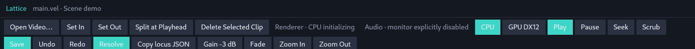

# Studio toolbar observe — affordance

Date: 2026-08-22  
Commit: `85b589ec260554f851c214731e607c7727c7cae8` (main)  
Lens: **Affordance only** (what the row teaches a first-time editor, and what it will be misread as).

---

## 1. Physical presentation of the current button row

At commit `85b589e`, the top of the Studio window renders a single flex container (`actions_bar` in `crates/lattice-studio/src/main.rs`) spanning the full window width:

```
[Open Video…] [Set In] [Set Out] [Split at Playhead] [Delete Selected Clip] | Renderer · CPU | Audio · Ok | [CPU] [GPU DX12] [Play] [Pause] [Seek] [Scrub] [Save] [Undo] [Redo] [Resolve] [Copy locus JSON] [Gain -3 dB] [Fade] [Zoom In] [Zoom Out]
```

Visual styling:
- **Container**: Flex row with `flex_wrap`, `gap_1`, background `#141821` (`PANEL`), bottom border `#2a3140` (`LINE`).
- **Standard buttons (17 items)**: Rectangular blocks with `#2a3140` (`LINE`) background and `#e8edf5` (`TEXT`) off-white label.
- **Teal buttons (4 items + active renderer toggle)**: Bright cyan `#3dd6c6` (`TEAL`) background. Always on for `Play`, `Save`, `Resolve`, and conditionally on for whichever renderer mode is active (`CPU` or `GPU DX12`).
- **Status telemetry (2 items)**: Plain text elements (`Renderer · <status>` and `<audio-status>`) with muted `#8b95a8` or error `#ff8f8f` text.

---

## 2. Element-by-element affordance breakdown

### A. Ingestion & In/Out Boundary Verbs

#### `[Open Video…]`
- **What it teaches a first-time editor**:
  "This is the standard 'Import Media' or 'Add Video' button to bring a new clip into my project or timeline bin."
- **What it is misread as**:
  - An asset importer.
  - **Actual mechanism**: Clicking this button invokes `StudioSession::open_video()`, which completely destroys the current editing session (`main.vel`) and replaces the entire project with a single-source fixture project.
  - **Misreading risk**: A first-time editor seeking to add a second video clip to an ongoing edit will click this button and inadvertently blow away their working document and timeline.

#### `[Set In]` & `[Set Out]`
- **What they teach a first-time editor**:
  "Standard NLE three-point editing Mark In / Mark Out points (like 'I' and 'O' in Premiere/Resolve/FCP) to set a loop region, playback range, or source-in subclip boundary before dropping onto the timeline."
- **What they are misread as**:
  - Non-destructive playback/export range markers on the timeline.
  - **Actual mechanism**: They directly execute `SemanticEdit::Trim { in_point: Some(at) }` or `SemanticEdit::Trim { out_point: Some(at) }`, which mutates the *pointed Source clip's start/end trim offsets* directly in the `.vel` source file.
  - **Misreading risk**: If no clip is selected (or a Title/Scene is selected), clicking them fails and outputs a refusal (`needs-source-binding`). If a clip is selected, clicking them immediately trims the physical duration and offset of that clip in the project without any preview drag or confirmation.

---

### B. Cutting & Clip Removal Verbs

#### `[Split at Playhead]`
- **What it teaches a first-time editor**:
  "The standard Razor/Blade tool (Cmd+K / Ctrl+B) that cuts the clip currently under the playhead into two adjacent clips."
- **What it is misread as**:
  - A clip slicing tool.
  - **Actual mechanism**: `Split` is a *Scene-level* semantic verb (`SemanticEdit::Split`). Under the verb-license spine and the hard lock that clicking a video clip points `Source` (not `Scene`), an editor who clicks the video clip they want to cut and presses `Split at Playhead` receives an immediate refusal:
    ```
    split is not legal for source "..." (needs-scene). split → scene:... — Navigate, do not retarget.
    ```
  - **Misreading risk**: The button is labeled with clip-cutting terminology ("Split at Playhead"), but refuses to operate on the very clip the editor just pointed on the timeline. It teaches the editor that the button is broken or capricious unless they already know the internal compiler distinction between a `Source` placement and a `Scene` container.

#### `[Delete Selected Clip]`
- **What it teaches a first-time editor**:
  "Delete or ripple-delete the currently selected clip, title, or callout on the timeline or canvas."
- **What it is misread as**:
  - Clip/element deletion.
  - **Actual mechanism**: On the Toolbar projection, `delete` routes exclusively to `LocusKind::Scene`.
  - **Misreading risk**: The button explicitly says "Delete Selected **Clip**", but clicking it with a video clip (Source locus) or text overlay (Title locus) selected fails with `delete is not legal for source/title (needs-scene)`. Conversely, when a Scene is focused, clicking it deletes the entire Scene (and all clips within it). The label says "Clip", but the mechanism deletes the container.

---

### C. Engine Telemetry & Renderer Toggles

#### `Renderer · CPU` / `Audio · Ok` (Status Labels)
- **What they teach a first-time editor**:
  Informational diagnostics.
- **What they are misread as**:
  - Because they are styled inline within the exact same horizontal flex row and padding as clickable buttons, they look like disabled buttons or clickable filter chips.
  - Sits immediately adjacent to the `CPU` and `GPU DX12` buttons, creating visual confusion between what is interactive and what is static text.

#### `[CPU]` & `[GPU DX12]`
- **What they teach a first-time editor**:
  Global preferences / rendering backend switcher.
- **What they are misread as**:
  - Export settings or output format switches rather than real-time preview compositor selection.
  - Placed squarely in the center of the primary editing toolbar with equal prominence to playback and cutting verbs, giving the impression that switching hardware renderers is a frequent, routine editorial action during video assembly.

---

### D. Transport Controls & The Seek-Verb Leftover

#### `[Play]` & `[Pause]`
- **What they teach a first-time editor**:
  Standard transport controls.
- **What they are misread as**:
  - In modern media players and NLEs, Play and Pause are either a single toggling button or clearly reflect state (e.g., Play highlights while running, Pause highlights when stopped).
  - Here, `Play` is permanently styled in bright `#3dd6c6` (`TEAL`) background regardless of whether playback is currently running or paused. `Pause` is permanently styled in dark `#2a3140` (`LINE`).
  - First-time editors read `Play` as an active/engaged state even when the playhead is static.

#### `[Seek]` (The Seek-Verb Leftover)
- **What it teaches a first-time editor**:
  "A prompt to enter a timecode to seek to, or a step-by-frame / jump-to-marker command."
- **What it is misread as**:
  - An interactive search or navigation tool.
  - **Actual mechanism**: Clicking `[Seek]` unconditionally calls `session.seek(Time::ZERO)`. It instantly teleports the playhead to `00:00:00.000` (the beginning of the timeline).
  - **Affordance gap**: It is a "Rewind to Start" button wearing the name "Seek". In the verb-license architecture, seeking is a transport coordinate navigation gesture, but the top bar retains a legacy discrete push-button left over from early test scaffolding.

#### `[Scrub]`
- **What it teaches a first-time editor**:
  "Audio scrub toggle (enable/disable hearing audio during timeline drag) or a Scrub Tool mode."
- **What it is misread as**:
  - An interactive scrubbing mode.
  - **Actual mechanism**: Clicking `[Scrub]` calls `session.scrub(this.session.playhead())`, which performs a one-off frame and audio-monitor refresh at the existing playhead position.
  - **Affordance gap**: Scrubbing is a continuous dragging interaction on the timeline or canvas. A discrete button named "Scrub" that performs an in-place frame sync feels like a no-op to an editor who expects "scrub" to be a gesture.

---

### E. Persistence, History, and Phase Boundaries

#### `[Save]`
- **What it teaches a first-time editor**:
  "Save changes to file."
- **What it is misread as**:
  - Because `[Save]` is permanently styled in bright `#3dd6c6` (`TEAL`), it draws primary visual focus even when the project is clean (`dirty == false`).
  - In standard UI affordance conventions, a high-contrast accented button signifies either "Unsaved changes exist / Action required" or a primary destructive/commit call-to-action (like "Export"). Here it is constantly bright, teaching the user that saving is permanently pending.

#### `[Undo]` & `[Redo]`
- **What they teach a first-time editor**:
  Standard edit history controls.
- **What they are misread as**:
  - Standard undo/redo, but placed midway through a sequence of disparate tools (`[Save] [Undo] [Redo] [Resolve] [Copy locus JSON]`), surrounded by compiler-phase triggers and clipboard serializers.

#### `[Resolve]`
- **What it teaches a first-time editor**:
  "Resolve project errors / merge conflicts" or DaVinci Resolve branding.
- **What it is misread as**:
  - A conflict resolution or syntax repair button.
  - **Actual mechanism**: Invokes `session.resolve_media()`, which executes external provider calls (TTS speech synthesis, font fetching) and writes `lattice.lock.json`.
  - **Affordance gap**: `Resolve` is a core architectural phase boundary in Lattice (separating compilation from provider I/O), but presented as an unadorned teal button on the top bar, a first-time editor has no visual hint of what external network/API operations will be triggered or what assets will be generated.

---

### F. Diagnostic Plumbing & Property Macros

#### `[Copy locus JSON]`
- **What it teaches a first-time editor**:
  "Copy the selected clip to clipboard to paste elsewhere on the timeline."
- **What it is misread as**:
  - Standard clipboard "Copy" (Ctrl+C / Cmd+C).
  - **Actual mechanism**: Serializes the active `LocusProjection` (compiler coordinates, AST span, provenance, legal verbs) into formatted JSON and writes it to the OS clipboard.
  - **Affordance gap**: Exposing internal agent/compiler AST telemetry directly on the top-level button bar alongside user-facing editing tools confuses the user as to whether Lattice is an editor for humans or a debugging harness for agents.

#### `[Gain -3 dB]` & `[Fade]`
- **What they teach a first-time editor**:
  "Preset audio effect macros."
- **What they are misread as**:
  - General audio tools or audio toggles.
  - **Actual mechanism**:
    - `[Gain -3 dB]` directly applies a hardcoded -3 dB decrement (`SemanticEdit::SetGain { db: -3 }`) to the selected Source clip. There is no complementary `+3 dB` button, no slider, and no numerical readout on the bar.
    - `[Fade]` unconditionally applies a fixed 500ms fade-in (`SemanticEdit::SetFade { fade_in: Some(500ms) }`).
  - **Affordance gap**: Hardcoded magic numbers (-3 dB, 500ms) presented as primary top-level buttons teach the editor that audio controls are arbitrary one-way macros rather than parametric properties.

#### `[Zoom In]` & `[Zoom Out]`
- **What they teach a first-time editor**:
  Timeline magnification controls.
- **What they are misread as**:
  - Canvas video zoom vs Timeline time scale zoom.
  - Located at the extreme right end of the top window toolbar, completely detached from the Timeline panel they control.

---

## 3. Thematic affordance observations

### 1. The Flat Aggregation of Five Architectural Domains
The current toolbar flattens 22 elements across 5 fundamentally separate conceptual layers into a single undifferentiated horizontal list:
1. **Document & Session Lifecycle**: `Open Video…`, `Save`, `Undo`, `Redo`
2. **Locus-Sensitive Semantic Edits**: `Set In`, `Set Out`, `Split at Playhead`, `Delete Selected Clip`, `Gain -3 dB`, `Fade`
3. **Engine Pipeline & Device Modes**: `Renderer · CPU`, `Audio · Ok`, `CPU`, `GPU DX12`
4. **Transport & Clock**: `Play`, `Pause`, `Seek`, `Scrub`
5. **Phase Boundaries, Agent Bridge & Viewport**: `Resolve`, `Copy locus JSON`, `Zoom In`, `Zoom Out`

With no visual dividers, grouping, or hierarchical zoning, every button presents the same rectangular affordance regardless of whether it mutates source code, triggers AI network calls, copies debug JSON, or starts video playback.

### 2. The Context-Free Button vs Context-Bound Locus Trap
All buttons in the toolbar appear permanently clickable and uniformly styled. However, half of the editing buttons are **locus-dependent verbs**:
- `Set In`, `Set Out`, `Gain -3 dB`, `Fade` require a `Source` locus.
- `Split at Playhead`, `Delete Selected Clip` require a `Scene` locus.

Because the toolbar provides no visual affordance indicating which locus kind is required or active, a first-time editor clicking a video clip on the timeline (which commits a `Source` locus) and then clicking `[Split at Playhead]` experiences an immediate rejection and a spoken error. The toolbar promises immediate global action, but operates as a hidden context-sensitive dispatcher.

### 3. NLE Vocabulary Clashes with Semantic Compiler Realities
Every standard video editing term on the bar deviates from traditional NLE behavior:
- `Open Video…` is not "Import asset to bin"; it is "Replace entire project".
- `Set In` / `Set Out` is not "Mark timeline range"; it is "Destructively trim source clip in code".
- `Split at Playhead` is not "Cut selected video clip"; it is "Split scene container".
- `Delete Selected Clip` is not "Delete clip"; it is "Delete entire scene".
- `Seek` is not "Navigate to timecode"; it is "Jump to 0s".
- `Copy locus JSON` is not "Duplicate clip"; it is "Serialize compiler IR".

### 4. Color Inversion and State Ambiguity
Teal (`#3dd6c6`) is overloaded across three incompatible UI meanings:
- **Radio toggle state**: Active renderer (`CPU` vs `GPU DX12`).
- **Static action emphasis**: `Save` and `Resolve` (permanently teal regardless of dirty or lock state).
- **Transport action**: `Play` (permanently teal even while actively playing).

A first-time editor cannot rely on color to understand system state, readiness, or dirty status.

---

## 4. Visual claims & live captures

Live capture of the current top-of-window button row and layout (`--ui-fixture timeline-basic` on X11):


*Figure 1: Live Studio window at commit `85b589e`. The top row flattens document operations, locus-bound semantic edits (`Set In`/`Set Out`/`Split`/`Delete`/`Gain`/`Fade`), engine telemetry, transport push-buttons (`Play`/`Pause`/`Seek`/`Scrub`), compiler phase triggers (`Resolve`), debug serializers (`Copy locus JSON`), and viewport zoom into an undifferentiated horizontal strip.*



*Figure 2: Close-up of the 22 top-row elements showing standard button styling, teal accent overload (`Save`, `Resolve`, `Play`, active `CPU`), and status text.*

---

## 5. 根本的見直し (Radical Rethink): Is a global top-of-window verb button row the right object?

The verb-license spine establishes strict architectural invariants:
- **One locus, one legal set, one utterance**: The Engine names what is legal for the currently pointed locus.
- **Touched projection is routing only**: Gestures on a surface commit real edits; when routing differs from legality, the difference is spoken.
- **Hard pointing locks**: Clicking a video clip points `Source` (not `Scene`); overlap resolution is projection-local; playhead scrub never re-points.

Given these invariants, **is a global top-of-window verb button row even the right object for a first-time editor?**

Cosmetic polish (renaming buttons, reordering them, or tweaking colors) does not resolve the foundational affordance contradiction:

### 1. The inherent falsehood of a global verb bar under a locus-centric compiler
A persistent, always-visible global button row presents the affordance: *"I am a set of global tools you can click at any time to perform an action."*  
In Lattice, however:
- `Split` is only legal on `Scene`.
- `Trim` (In/Out), `Gain`, `Fade` are only legal on `Source`.
- `Title` text is only legal on `Title`.
- Overlays (`Title`/`Callout`) accept position and scale on `Canvas`.

When buttons live in a global top bar detached from the surfaces where those entities live, clicking them inevitably triggers refusals and spoken gap explanations (e.g. clicking a clip then clicking `Split` produces `split is not legal for source (needs-scene)`). A global verb bar constantly invites the editor to click actions that are illegal for what they just touched.

### 2. Radical rethink: No global verb home; verbs live only where projections commit
Instead of maintaining a global toolbar as a catch-all "button dock", the editor interface should eliminate the top verb bar entirely:
- **Timeline is the commit home for temporal & sequence edits**:
  - Direct trimming via clip boundary drag handles (not discrete `Set In`/`Set Out` buttons).
  - Direct scene splitting and reordering via timeline gestures or contextual split affordances anchored to the playhead on the Scene track.
- **Canvas is the commit home for spatial placement**:
  - Direct translation (drag) and four-corner aspect-preserving resize on overlays (not macro coordinates).
- **Inspector is the commit home for parametric properties & disclosures**:
  - Title text, timing fields, gain dB sliders, and fade duration inputs appear in the Inspector **only when the corresponding locus is pointed**.
  - The Inspector speaks the complete legal set, disclosing `(verb, target, scope, effect)` and navigating to related loci (e.g. navigating from pointed `Source` to related `Scene`) rather than offering blind push-buttons.
- **Transport controls belong to the Timeline / Preview transport dock**:
  - `Play` / `Pause` belong on the timeline playback clock (with proper toggle state reflecting playback).
  - `Seek` and `Scrub` are continuous timeline navigation gestures, not discrete top-level buttons that teleport to `0s` or trigger one-off frame syncs.
- **Phase boundaries & document operations belong in window/application chrome**:
  - `Save`, `Undo`, `Redo` belong in standard application menus / titlebar chrome.
  - `Resolve` (the boundary between compilation and external provider I/O) belongs in a dedicated phase status banner or review/lock workspace panel with clear disclosure of provider I/O.
  - `Copy locus JSON` belongs in developer/agent debug tooling, not prime end-user editorial real estate.

### 3. Conclusion
A global top-of-window verb button row is an artifact of early test scaffolding. For a first-time editor operating under the verb-license spine, verbs should exist **only on the projections that actually commit them**, backed by the Inspector's spoken disclosure of the Engine's legal set.

---

## 6. Visual claims (live captures) vs frozen mockup references

- **Live Studio Window Capture (Current @ `617991b`)**: `https://github.com/annenpolka/lattice/blob/617991b9750c902cf062976470610f59927f1893/docs/notes/assets/2026-08-22-studio-toolbar/toolbar-top-row.png?raw=true`
- **Live Toolbar Row Crop (Current @ `617991b`)**: `https://github.com/annenpolka/lattice/blob/617991b9750c902cf062976470610f59927f1893/docs/notes/assets/2026-08-22-studio-toolbar/toolbar-button-row-cropped.png?raw=true`

For historical comparison against frozen design mockups (pre-spine):
- Frozen manipulate mockup: `https://github.com/annenpolka/lattice/blob/85b589ec260554f851c214731e607c7727c7cae8/docs/mockups/studio/screens/manipulate.jpg?raw=true`
- Frozen navigate mockup: `https://github.com/annenpolka/lattice/blob/85b589ec260554f851c214731e607c7727c7cae8/docs/mockups/studio/screens/navigate.jpg?raw=true`
- Frozen review mockup: `https://github.com/annenpolka/lattice/blob/85b589ec260554f851c214731e607c7727c7cae8/docs/mockups/studio/screens/review.jpg?raw=true`

