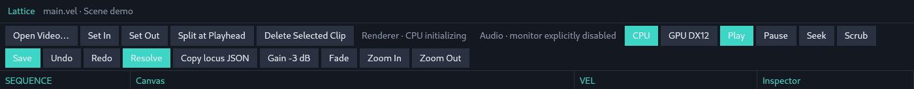
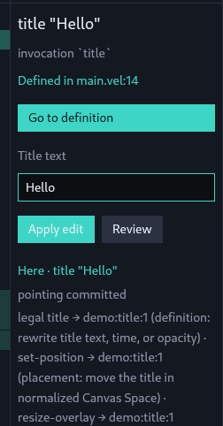
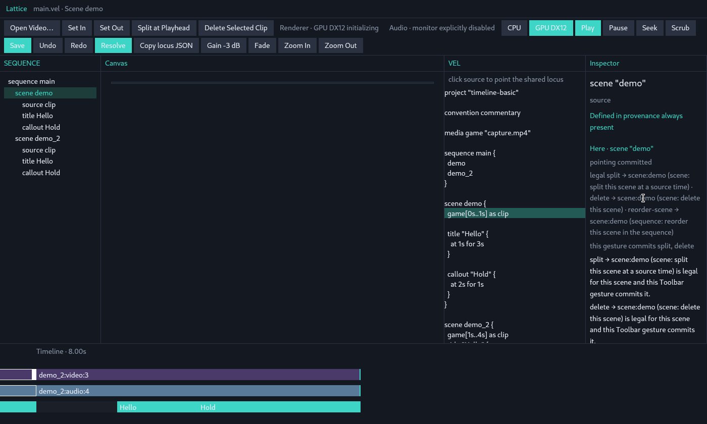
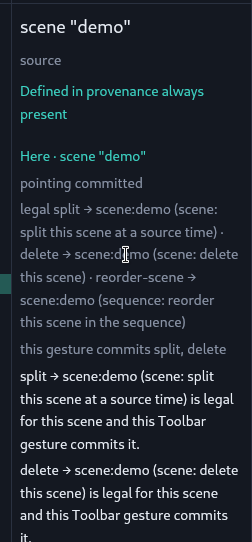

# Studio toolbar — interaction (is a global verb row the right object?)

Date: 2026-08-22
Observed on: `85b589ec260554f851c214731e607c7727c7cae8` (`main` after #23 + #22 + #24)
Fixture: `--ui-fixture timeline-basic` (Linux smoke window; preview and audio monitor off)
Lens: interaction only. What a click commits, what it speaks, and whether a
global top-of-window verb **button row** is even a coherent object under the
locked spine.

This is not a layout pass. Spacing, labels, and grouping of Gain / Fade / Split /
Delete chrome are out of scope. No Studio implementation in this note.

## The spine this has to survive

One locus. One Engine legal set. One utterance. Gesture is routing. Speak when
legality ≠ what this gesture can commit. No silent `target_*_locus`.

A gesture on a projection says what it commits for **this** here. It does not
invent a second legal set and it does not retarget.

## The question

Is a **global** top-of-window verb BUTTON ROW the right interaction object?

Allowed answers include: no global verb home; verbs only where the projection
already commits; the spoken / legal set as the invoke; Inspector / Canvas /
Timeline as the only commit surfaces.

Not allowed: reopen overlap-as-cross-surface modal, video-click-promotes-to-scene,
silent retarget, per-view selection, Core Freeze, GPUI in Core.

## Claim 1 — the row does not wait for here

First paint. Here is title `"Hello"`. Engine legal set is `title`,
`set-position`, `resize-overlay`. The touched projection is Timeline, which
routes `title` only. The utterance already speaks the rest: position and resize
are legal, committed on Canvas — not implied absent.

The top chrome still offers **Set In**, **Set Out**, **Split at Playhead**,
**Delete Selected Clip**, **Gain -3 dB**, **Fade**. None of those verbs are
legal for this title. The buttons do not hide, disable, or become the utterance.
They are an always-on invoke.





A gesture-that-routes has a surface and a here **before** it names verbs. A
window-top strip has neither. It becomes "Toolbar" only after the click stamps
`touched_projection`. That stamp is a routing object invented to host buttons,
not a projection anyone pointed.

## Claim 2 — the same button is a lie, then a sentence

Clicks on that strip while here stayed title `"Hello"` (live log,
`LATTICE_STUDIO_LOG`):

| Click | Commits | Speaks |
|---|---|---|
| Split at Playhead | nothing; here stays title | `split is not legal for title "Hello" (needs-scene).` |
| Set In | nothing; here stays title | `trim is not legal for title "Hello" (needs-source-binding).` |
| Gain -3 dB | nothing; here stays title | `set-gain is not legal for title "Hello" (needs-source-binding).` |

The refuse is correct. The lock holds: no silent retarget. The object that
produced it is still wrong. A control that is usually illegal, and that
explains itself only after being pressed, is not a gesture. It is a global
verb menu with a post-hoc utterance.

The spoken refuse is also stuffed into Inspector `last_render`, which the
window prefixes `wrote `. The row has no utterance of its own.

## Claim 3 — Split on a Scene *does* commit, because orphans live here

Pointing scene `"demo"` (Sequence tree; not a second selection) and pressing
**Split at Playhead** rewrote VEL: `game[0s..4s]` became `game[0s..1s]`,
duration went `4s → 8s`, and `scene demo_2` appeared. Here stayed
`scene:demo`. That click was a real `SemanticEdit::Split` through
`apply_edit` / `target_locus_for`. Toolbar is a commit surface for verbs
that have no Timeline / Canvas / Inspector gesture.

That is why the row exists: leftover homes for `set-gain`, `set-fade`,
`split`, `delete`. It is not evidence that a global verb object is required.
It is evidence those verbs were never given a committing gesture on the
projection that already owns them.





**Gain -3 dB** on that same scene spoke and did not retarget:

```text
set-gain is not legal for scene "demo" (needs-source-binding).
set-gain needs a source binding. Point the video clip.
```

Same chrome. Opposite act. The row cannot be "the verb surface" if half of
its verbs are legal only after a different point.

## Claim 4 — pointing a source already confesses the invented home

Sequence-tree click on `source:clip` (log `reason=tree-select`). Here is the
source. Engine legal set is `trim`, `set-gain`, `set-fade`. Sequence routes
**nothing** (`routed: []`). The utterance speaks:

- `trim` … committed on Timeline — not implied absent here
- `set-gain` / `set-fade` … committed on Toolbar — not implied absent here
- scene `"demo"` is a relation; `split` / `delete` / `reorder-scene` named
  there — Navigate, do not retarget

Then **Split at Playhead** on that source spoke and did not adopt the scene:

```text
split is not legal for source "clip" (needs-scene).
split → scene:demo (scene: split this scene at a source time) — Navigate, do not retarget.
```

The spine already knows Toolbar is the only commit path for gain / fade /
split / delete. That confession is the leftover. It is not a product
requirement to keep a window-top verb object.

## Claim 5 — a non-verb inherits the Toolbar stamp

`Play` does not touch a projection. After the scene split, `touched_projection`
was still Toolbar. Play logged `reason=play` with:

```text
this Toolbar gesture commits split, delete
```

The last click was transport. The utterance still described a Toolbar verb
gesture. An invented verb home leaks routing onto clicks that are not verbs.

`Seek` sits in the same strip. It is leftover placement: playhead to `0s`,
no `point_from_timeline_time`, no verb, no speak. Naming it is enough. It is
not this assignment.

## First principles

Gesture-is-routing means the surface you touched names what it can commit for
this here. Sequence, Timeline, Canvas, Inspector, and Review are surfaces
people point. "Toolbar" is a stamp applied to a strip that is also Save,
Resolve, CPU / GPU DX12, Zoom, Copy locus JSON, Play, Pause, Seek, Scrub, and
Open Video. Teal on Play / Save / Resolve / CPU is not "this commits a legal
verb." The strip is not a verb object that happens to be messy. It is a
command dump that absorbed orphan verbs.

Therefore a **global verb BUTTON ROW is the wrong object**.

Not a tighter grouping. Not better labels. The object should not exist.

## What would be the right object

These are interaction replacements, not chrome sketches.

**No global verb home.** Commit only where a projection already has a gesture:

- Timeline already commits trim, overlay time, scene reorder.
- Canvas already commits `set-position` and `resize-overlay`.
- Inspector already commits title text when here is Title.

`set-gain`, `set-fade`, `split`, and `delete` stay **spoken** until a real
gesture exists on one of those surfaces. Spoken-as-routed-elsewhere is honest.
A permanent button that is illegal for most heres is not.

**The utterance / legal set is the invoke** for a verb that has no pointer
gesture yet. One locus, one Engine legal set. If an explicit click is needed,
it is a click on a spoken legal clause (an Inspector gesture), not a second
mute legal set in the header.

**Fill the hole on the projection that owns the verb**, if those verbs must
be committable now:

- Gain / fade belong on the source-binding surface (Inspector properties when
  here is Source, or a Timeline gesture on the audio clip). Not a window-top
  button that is also present on Title and Scene.
- Split / delete belong on the Scene surface. Sequence currently routes
  nothing; Timeline already reorders scenes. That is the hole. A Sequence row
  or a Timeline scene-clip gesture can commit them. The utterance already
  names them legal for a pointed scene.

Transport, renderer choice, Save, and Resolve are not verbs-for-here. If they
remain at the top they are a different object and must not wear verb-row
meaning. Do not keep Split next to Play to "have a toolbar."

**Delete Selected Clip** names a selection the spine forbids. Even as a
label, it assumes a per-view clip selection. The act is `SemanticEdit::Delete`
on **here** when here is a Scene. That is further evidence the row is a
foreign object, not a naming nit.

## Locks held (not reopened)

- Overlap stays Projection-Local: failed point → candidates on that
  projection; no cross-surface modal; one `LocusId` after pick.
- Video click keeps the source clip; no scene promotion.
- One locus, one Engine legal set, one utterance. Gesture is routing. Speak
  when legality ≠ routing. No silent `target_*_locus`.
- Scrub / Seek do not `point_from_timeline_time`. Title fields only on Title.
  No freeze row. No Core Freeze. No per-view selection. No GPUI in Core.

## Not in this note

A new toolbar. A walk video. How to space or group the current buttons.
Other observers' notes.

## Live log (same process)

`/tmp/lattice-toolbar-observe/studio.log` on the observing run, pid 11973.
First paint: title here, Timeline routing. Toolbar refuses on title, then
Sequence point of source (empty route, "committed on Toolbar"), Split refuse
on source with Navigate, Sequence point of scene, Split commit (`demo_2`),
Gain refuse on scene, Play inheriting the Toolbar stamp.

## Phase III vote (chair frame)

Chair narrows the claim: the current **fixed, always-visible bank of
locus-taking `SemanticEdit` buttons** is not a coherent global verb surface.
A **session strip may remain global**. This addendum votes that frame. It
does not pick a shipping winner for orphan verbs.

**Objects under vote**

| Object | What it is on the live row | Vote |
|---|---|---|
| Locus-taking edit bank | Set In, Set Out, Split at Playhead, Delete Selected Clip, Gain -3 dB, Fade | **DELETE** |
| Session strip | transport, renderer request, Save, Resolve, Open Video, Zoom, Copy locus JSON | **KEEP** as a non-verb global |

No **STEAL** of the six buttons into another global verb home. That would
recreate the bank. Orphan commit paths (`set-gain` / `set-fade` / `split` /
`delete`) stay named leftovers, not a replacement object.

**Six tests (interaction: commit vs speak)**

| # | Test | Locus-taking bank | Session strip |
|---|---|---|---|
| 1 | Standing invitation for a locus-taking edit? | **Fail.** The six buttons are that invitation. They are offered before here is relevant. A standing invite that usually speaks refuse is not a gesture. | **Pass.** These clicks do not take a locus and do not `apply_edit`. |
| 2 | Target / scope / effect / parameter / committing projection disclosed before commit? | **Fail.** The button names a verb (and sometimes a fixed parameter: −3 dB, playhead). Target, scope, effect, and the Toolbar stamp appear only after the click — refuse in `last_render` (`wrote …`), or utterance after `touched_projection = Toolbar`. Set In / Split do not show the mapped source time. | n/a as a verb surface. No locus-taking disclose to do. |
| 3 | Engine only legality authority? | **Gate pass, surface fail.** `target_locus_for` uses Engine `is_legal_verb`. The bank does not override a refuse. It still authors a second invitation set the Engine never named for this here. | **Pass.** No legality set. Renderer / Resolve / Save are phase or session acts. |
| 4 | One here, fail-closed, no target search / promotion? | **Commit path pass.** Title/source/scene clicks spoke and did not retarget (Claim 2, 3, 4). Video-click and overlap locks were not reopened. **Invitation fail:** the bank is offered as if here were optional. | **Pass.** Play / Seek / Scrub / Save do not search a target. Seek leftover: playhead only. |
| 5 | Every legal edit has a named route or is spoken unrouted? | **Fail as this object.** The utterance already does this work (Claim 1, 4). The bank does not speak unrouted verbs until pressed. After press it *becomes* the named route ("committed on Toolbar") — a circular home for orphans. | **Pass.** Not in the legal-edit route table. |
| 6 | Non-verb global controls grouped by actual authority? | **Fail.** The bank shares one wrap with Play / Save / Resolve / CPU. Teal is not verb-commit. Play inherited the Toolbar stamp (Claim 5). | **Fail today, keepable.** Same wrap. KEEP means split the object, not keep the mix. |

**Vote.** DELETE the locus-taking bank as a global verb surface. KEEP a
session strip as a different global object. Do not STEAL the six buttons
elsewhere on the window. Do not decide here whether orphans stay spoken or
gain a projection gesture — that would be a shipping winner.

Locks unchanged. Same PNGs as Claims 1 and 3: the bank is visible on title
(illegal) and still visible after a scene Split (some legal, Gain not).
