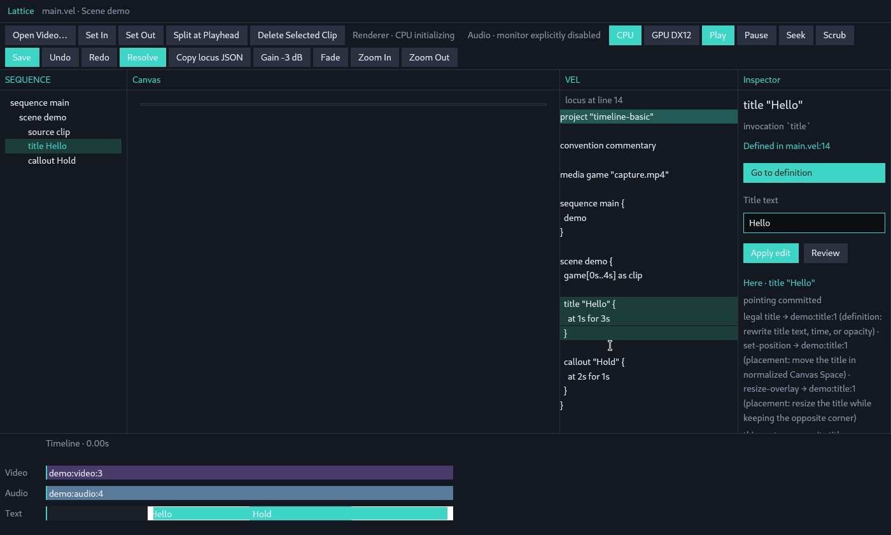
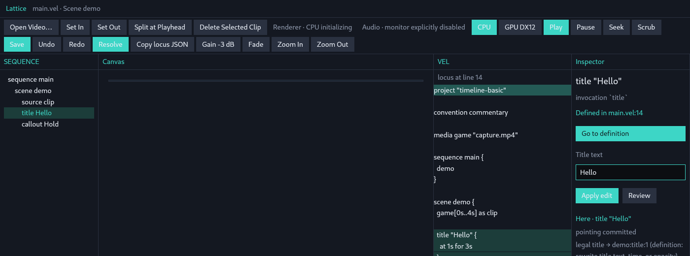
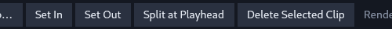
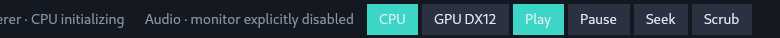
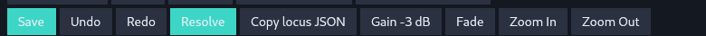

# Studio toolbar observe — structure

Date: 2026-08-22
Observed HEAD: `85b589ec260554f851c214731e607c7727c7cae8` (`#24` on `#23` + `#22`)
Fixture: `--ui-fixture timeline-basic` (client `1400×840`, `LATTICE_STUDIO_PREVIEW=0`, `LATTICE_STUDIO_AUDIO_MONITOR=0`, `LATTICE_STUDIO_RENDERER=cpu`)
Lens: structure only — what the top chrome is made of, and who owns state.

This is not a Toolbar widget, not a second selection, and not a product chrome redesign.

## What the top chrome is

`StudioView::render` stacks four siblings, top to bottom: `header_bar` → `actions_bar` → `body` → `timeline_bar` (`crates/lattice-studio/src/main.rs`). The live top button row is the first two of those siblings. Neither is a `Toolbar` type.

A third layer sits *outside* that stack: the GPUI/WM titlebar created by `WindowOptions { titlebar: TitlebarOptions { title: "Lattice Studio · {CPU|GPU DX12}" } }`. XFCE reports `_NET_FRAME_EXTENTS` top `28`. The client grab starts at `header_bar`; the decorated grab includes the WM title.

`Projection::Toolbar` is an enum variant on `StudioSession.touched_projection`. It is a routing tag. It is not a view, not a widget, and not a store.




## `header_bar`

Free function `header_bar(file: &str)`. No `StudioView` receiver. No buttons. No `debug_selector`. Height is fixed `36px`.

| Slot | Live text | Source |
|---|---|---|
| brand | `Lattice` | literal, `TEAL` |
| file | `main.vel · Scene demo` | `StudioLayout.file_label` + literal ` · Scene demo` |

`file` is the path basename from `StudioSession.path()` (`layout::file_label`). On this fixture that is `main.vel`. Layout failure falls back to `"main.vel"` in `render`. The row owns no state.


## `actions_bar`

`StudioView::actions_bar` is a wrap flex (`flex()` + `flex_wrap()` + `gap_1` + `px_2` + `py_1`). It is a render method, not a store. At the launched `1400×840` client it wraps to two visual lines. `smoke_geom.play` is `{x:1115, y:67, w:51, h:30}`: Play sits on wrap line 1; wrap line 2 starts at `Save`.

Children are either `action_button(label, color, …)` or a status `div`. Play is the one special-case: same label/color pattern, plus `capture_any_mouse_down` and a geom canvas that writes `StudioView.play_geom`. It is the only top-chrome control published to `LATTICE_STUDIO_GEOM`.

`action_button` is a local helper. Inspector `Apply edit` / `Review` reuse it; those two are not in this row.

Teal on this row is a constructor argument, not a selection owner:

- `CPU` / `GPU DX12`: `TEAL` iff `StudioView.renderer` matches that `RendererRequest`
- `Play`, `Save`, `Resolve`: hardcoded `TEAL`
- every other button: hardcoded `LINE`
- status chips: `MUTED`, or `0xff8f8f` when `StudioView.renderer_error` / `audio_error` is set

Idle fixture (`playing=false`, playhead `0s`) still shows teal on Play / Save / Resolve. That is paint, not transport or locus state.


### Inventory (live `timeline-basic`, left to right)

| Wrap | Label | Kind | `debug_selector` | Click writes |
|---|---|---|---|---|
| 1 | Open Video… | button | `toolbar.import` | `StudioView.open_video_clicked` → may replace `StudioView.session` |
| 1 | Set In | button | `toolbar.set-in` | `StudioSession.set_in_at_playhead` (`touched_projection = Toolbar`, `SemanticEdit::Trim`) |
| 1 | Set Out | button | `toolbar.set-out` | `StudioSession.set_out_at_playhead` (same, out point) |
| 1 | Split at Playhead | button | `toolbar.split` | `StudioSession.split_at_playhead` (`SemanticEdit::Split`) |
| 1 | Delete Selected Clip | button | `toolbar.delete-clip` | `StudioSession.delete_selected_clip` (`SemanticEdit::Delete`) |
| 1 | Renderer · CPU initializing | status chip | `toolbar.renderer-status` | none |
| 1 | Audio · monitor explicitly disabled | status chip | `toolbar.audio-status` | none |
| 1 | CPU | button | `toolbar.renderer.cpu` | `StudioView.set_renderer(RequireCpu)` |
| 1 | GPU DX12 | button | `toolbar.renderer.gpu-dx12` | `StudioView.set_renderer(RequireGpuDx12)` |
| 1 | Play | button (geom) | `toolbar.play` | `StudioView.start_play` |
| 1 | Pause | button | `toolbar.pause` | `StudioView` transport fields + `StudioSession.pause` |
| 1 | Seek | button | `toolbar.seek-start` | `StudioSession.seek(Time::ZERO)` |
| 1 | Scrub | button | `toolbar.scrub` | `StudioSession.scrub(session.playhead())` |
| 2 | Save | button | `toolbar.save` | `StudioSession.save` |
| 2 | Undo | button | `toolbar.undo` | `StudioSession.undo` |
| 2 | Redo | button | `toolbar.redo` | `StudioSession.redo` |
| 2 | Resolve | button | `toolbar.resolve` | `StudioSession.resolve_media` |
| 2 | Copy locus JSON | button | `toolbar.copy-locus` | clipboard ← `StudioSession.current_projection_json` |
| 2 | Gain -3 dB | button | `toolbar.gain-minus-3` | `StudioSession.set_gain(-3)` |
| 2 | Fade | button | `toolbar.fade` | `StudioSession.set_fade(500ms)` |
| 2 | Zoom In | button | `toolbar.zoom-in` | `StudioSession.zoom_around(playhead, 1.25)` |
| 2 | Zoom Out | button | `toolbar.zoom-out` | `StudioSession.zoom_around(playhead, 0.8)` |

`debug_selector` is a test-only no-op in the product binary (`docs/studio-linux-smoke.md`). The names exist in `action_selector`; the OS smoke does not use them.

## Who owns state

```
Engine            legal set, compile, inspect, resolve, apply
StudioSession     current LocusId, playhead, playing, undo/redo, compilation,
                  viewport, touched_projection, last_spoken   (no GPUI types)
StudioView        owns the session instance; plus renderer request/selection/error,
                  audio monitor/status, play_origin, preview slots, last_render
header_bar        owns nothing
actions_bar       owns nothing (reads View/Session, writes through their methods)
Projection::Toolbar  routing tag on session.touched_projection
```

`StudioSession` is documented as GPUI-free (`session.rs`). Core stays out of this row.

Locus: `session.current`. Toolbar verbs go through `target_locus_for` → that same `current`. There is no toolbar-local locus and no per-view selection.

Legal set: Engine (`legal_edits_for` / `is_legal_verb`). `routed_verbs(Projection::Toolbar, …)` is routing only: Source → `trim` / `set-gain` / `set-fade`; Scene → `split` / `delete`. A refused edit sets `session.last_spoken`; `StudioView.speak_toolbar` copies that string into `StudioView.last_render`.

`last_render` is painted in the Inspector pane (`wrote {…}`), not in `header_bar` or `actions_bar`. Utterance (`Here ·` / `legal` / `this gesture commits`) is Inspector `utterance_block`, derived from `session.utterance()`. The top chrome does not host the utterance.

Renderer request lives on `StudioView` (`RendererRequest`), initialized from `LATTICE_STUDIO_RENDERER` / default CPU, and is also the window-title suffix. Session preview jobs take that request as an argument; Session does not own the toggle.

Audio status chips read `StudioView` audio fields. This Linux fixture forces `LATTICE_STUDIO_AUDIO_MONITOR=0`, so the chip is `Audio · monitor explicitly disabled`.

Transport: `session.playing` + `session.playhead` are Session-owned. `StudioView.play_origin`, `audio_play_pending`, and preview/audio inboxes are View-owned. Play / Pause / Seek / Scrub buttons write those; they do not point.

Viewport zoom is `StudioSession.viewport`. Undo/redo are `StudioSession` source stacks (volatile working-session history). Save writes `session.path`. Resolve writes `lattice.lock.json` through Engine.

## 根本的見直し / radical-rethink

Question: is a **global top-of-window verb button row** even the right object?

Cosmetic wrap / teal / grouping is out of scope. This section does not reopen overlap UI, video-click identity, silent `target_source_locus` / `target_scene_locus` fallthrough, per-view selection, Core Freeze, or GPUI in Core.

### Toolbar is not an object

The live row is not a `Toolbar` widget and not a pane. `Projection::Toolbar` is a routing stamp on `StudioSession.touched_projection`. `actions_bar` is one wrap flex of 20 buttons + 2 chips. Six of the twenty stamp `Toolbar` and call `apply_edit`:

| Stamp `Toolbar` | Verb |
|---|---|
| Set In / Set Out | `trim` |
| Split at Playhead | `split` |
| Delete Selected Clip | `delete` |
| Gain -3 dB | `set-gain` |
| Fade | `set-fade` |

The other fourteen are a different object: import, renderer request/status, audio status, transport (Play / Pause / Seek / Scrub), save, undo/redo, resolve, locus JSON dump, viewport zoom. They share a constructor (`action_button`) and a `toolbar.*` selector prefix. They do not share a store, a legal set, or a commit surface.

Asking how to polish "the Toolbar" assumes that mixed flex is one thing. It is not.

### The row does not own here, legal, or routing

Live first paint (`timeline-basic`, not relaunched): `session.current` is `demo:title:1` (Title / Hello). `touched_projection` is Timeline. Engine legal is `title`, `set-position`, `resize-overlay`. Routed on Timeline is `title`. `routed_verbs(Toolbar, Title)` is empty.

Sequence paints that same here. Inspector paints Title fields, `Apply edit` (`touched_projection = Inspector`, `SemanticEdit::Title`), and `utterance_block` (legal + spoken). The top row still paints Set In / Set Out / Split / Delete / Gain / Fade. Those constructors do not read `legal_edits_for` or `routed_verbs`. They are always-on.




`speak_toolbar` writes `StudioView.last_render`, painted in Inspector as `wrote {…}`, not as a change to the button row. Refusal is spoken off-row. The row never becomes the utterance.

### Where commits actually live

`routed_verbs` (routing, not legality):

| Projection | Kind | Commits |
|---|---|---|
| Timeline | Source | `trim` |
| Timeline / Inspector | Title | `title` |
| Timeline | Callout | `callout` |
| Timeline | Scene | `reorder-scene` |
| Canvas | Title / Callout | `set-position`, `resize-overlay` |
| Toolbar | Source | `trim`, `set-gain`, `set-fade` |
| Toolbar | Scene | `split`, `delete` |
| Toolbar | Title | ∅ |

Timeline, Canvas, and Inspector are panes that already host a commit. Toolbar is only a stamp. `split` / `delete` / `set-gain` / `set-fade` currently have no pane route except that stamp. That is an ownership fact, not a license to invent a fourth selection or a Core type.

### Allowed object (named, not implemented)

A global verb home is the wrong object. Verbs belong where a projection already commits: Timeline, Canvas, Inspector. The Engine legal set plus the one utterance already say what is legal and what this gesture commits; they do not need a second, always-on button list. Transport / renderer / save / resolve / zoom, if they remain chrome, are not verbs and are not `Projection::Toolbar`.

Locks stay closed: one `LocusId` after a projection-local pick; video click keeps the source clip; legality ≠ routing is spoken, never a silent retarget; scrub/playhead do not `point_from_timeline_time`; Title Inspector fields only on Title; no per-view selection; no GPUI in Core.

## Phase III vote (structure / who owns state)

Chair frame only: the current fixed always-visible bank of locus-taking `SemanticEdit` buttons is not a coherent global verb surface. A session strip may remain global. This is not a shipping winner.

**Vote:** **DELETE** the global locus-taking bank. **Name** a **session strip** (non-verb, grouped by actual authority). Verbs stay on the panes that already commit (Timeline / Canvas / Inspector). `Projection::Toolbar` stays a stamp, not a surface.

Locks unchanged. Seek leftover stays named: transport, not a verb home.

| # | Test | Current bank (always-on Set In / Out / Split / Delete / Gain / Fade) | Named: session strip + pane commits |
|---|---|---|---|
| 1 | standing invitation for a locus-taking edit? | Always painted, unbound from here / legal. Not a coherent invitation. **DELETE.** | Strip must not invite locus-taking edits. Invitation belongs on the pane that commits. |
| 2 | target / scope / effect / parameter / committing projection disclosed before commit? | Button label only. Disclosure is Inspector `utterance_block`. **FAIL.** | Non-verbs disclose nothing legal. Verbs disclose on the pane + the one utterance. |
| 3 | Engine only legality authority? | `apply_edit` → `is_legal_verb` (Engine). Paint / enablement does not ask Engine. Surface **FAIL.** | Strip must not claim legality. Engine remains the only authority. |
| 4 | one here, fail-closed, no target search / promotion? | Commit path **PASS**: `target_locus_for` uses `session.current` only. Keep this. | Same here. Strip does not point. |
| 5 | every legal edit has a named route or is spoken unrouted? | Spine already names / speaks. Bank implies Toolbar routes that are empty for Title. Surface **FAIL.** | Strip is not a route table. Unrouted stays spoken. |
| 6 | non-verb global controls grouped by actual authority? | **FAIL.** One wrap flex. Gain / Fade sit next to Save / Resolve / Zoom. | **This is the strip.** Group by owner: `StudioView` renderer / audio; `StudioSession` transport / undo / save / viewport; Engine resolve. |







## Seek leftover

`Seek` is a child of `actions_bar` wrap 1 (`toolbar.seek-start`) and calls `session.seek(Time::ZERO)`. Seek-verb placement remains an open leftover; this note only records that the control currently lives in this row.

## Observation record

- Process: `./target/debug/lattice-studio --ui-fixture timeline-basic` on `DISPLAY=:1`
- Client XID `0x1a00001`, title `Lattice Studio · CPU`, `1400×840+1+57`
- `smoke_geom.play` `{x:1115, y:67, w:51, h:30}`
- `semantic_state` at first paint: locus `demo:title:1` / title / Hello; `projection` Timeline; `playing` false; playhead `0s`
- Rethink shots are crops of that same client grab. Studio was not relaunched.
