# Studio interaction observation (main @ 60ce42f)

Observation only. No Studio UI code was changed.
Starting ref: `main` / `60ce42f51ce64c3db05ce693b1605b249828038e` (PR #2 `feat/alpha-studio` merge).

Studio is treated as a Lattice Engine client: one shared locus, no per-view selection model, no GPUI types in Core, FFmpeg as I/O/backend, text-first working source, no in-process LLM SDK, no hidden compile/resolve.

This is not a product-Linux close. Linux here is the documented enabling smoke path (`docs/studio-linux-smoke.md`).

## How this was read

1. Source: `crates/lattice-studio/src/{main,session,interaction,gesture,canvas,layout,ui_driver}.rs`, `crates/lattice-core/src/locus.rs`, `crates/lattice-engine/src/{locus,edit}.rs`.
2. Headless product tests: `crates/lattice-studio/tests/interaction.rs`, `tests/session.rs`, `src/ui_driver.rs` `#[gpui::test]`.
3. OS sequences on this VM:
   - `DISPLAY=:1 ./scripts/studio-linux-smoke.sh --fixture timeline-basic` (preview/audio detached).
   - `lattice-studio /tmp/lattice-observe/main.vel` with `LATTICE_STUDIO_PREVIEW=1` and a 4s `testsrc` MP4.

Semantic lines from the second session: [`docs/artifacts/observe-b-interaction.log`](artifacts/observe-b-interaction.log).

## Interaction stack (what actually owns what)

GPUI translates pointer/key events. It does not rewrite VEL.

| Layer | Owns | Must not |
|---|---|---|
| `StudioView` (`main.rs`) | pixels, focus, toolbar chrome, preview/audio transport | Core types, filtergraphs |
| `StudioSession` | playhead, viewport, Undo stacks, ephemeral canvas drag/resize, current `LocusId` | a second selection model |
| `interaction` / `gesture` / `canvas` | begin → update → commit / Escape | GPUI types |
| Engine `propose` / `apply_proposal` | one `SemanticEdit` → one source rewrite | GPUI |

Lifecycle (documented and implemented): pointer down begins, move updates ephemeral geometry only, up commits one edit/compile/Undo, Escape cancels. Playhead is transient editor state. Scrub does not push Undo.

## Actual interaction paths

### Pointer

Root handlers on `StudioView::render`:

- `on_mouse_move` → canvas update if a canvas gesture is live, else timeline update if `session.gesture().is_active()`, else hover cursor.
- `on_mouse_up` / `on_mouse_up_out` → canvas commit, else timeline commit.
- `on_scroll_wheel` → `handle_scroll` always maps to `TimelineViewport` (`zoom_around` with Control, else `scroll_pixels`). The VEL pane is `overflow_scroll` but does not stop this root handler.

Hit surfaces:

| User action | Handler | Session call |
|---|---|---|
| SEQUENCE row click | `tree_node` `on_click` | `point_at(LocusId)` then `sync_playhead_to_current` if the playhead is outside that locus span |
| Canvas overlay body | overlay `on_mouse_down` | `begin_canvas_overlay_drag` → `SemanticEdit::SetPosition` |
| Canvas corner handle | `canvas_resize_handle` `on_mouse_down` | `begin_canvas_overlay_resize` → `SemanticEdit::ResizeOverlay` |
| Timeline ruler | `capture_any_mouse_down` | `begin_timeline_scrub` |
| Timeline rail / clip | rail `capture_any_mouse_down` | `begin_timeline_pointer_on(x, alt, trackName)` |
| VEL line | line `on_mouse_down` + `shape_line` x-hit | `point_from_source_offset` |
| Inspector Go to definition | `on_click` | `go_to_definition` → select/scroll/focus VEL |
| Inspector Apply edit | `on_click` | `apply_title_text(title_draft)` |
| Inspector Review | `on_click` | `propose_title_text(title_draft)` |
| Review Apply / Reject | `review_button` | `apply_review` / `reject_review` |
| Toolbar buttons | `action_button` / Play `capture_any_mouse_down` | see keyboard/toolbar table |

Trim chrome (`timeline.trim.<id>.in/.out`) is painted when `handles` is true. Those divs have **no** `on_mouse_down`. Hit testing is `gesture::hit_test` on the rail (`TRIM_HANDLE_PX = 8`). Handles appear only after the clip/scene is the current locus.

Audio rail: `hit_clips_on_track(..., "Audio")` clears clips, so every audio-track down is `TimelineGesture::Scrub`.

### Keyboard

`handle_key` (root, `track_focus` on the window):

| Key | Effect |
|---|---|
| Ctrl-Z | `session.undo` |
| Ctrl-Shift-Z / Ctrl-Y | `session.redo` |
| Escape | cancel canvas, else cancel timeline |
| `=` / `+` | zoom in around playhead |
| `-` | zoom out around playhead |

Not bound: Space, I/O, S, Delete, J/K/L, arrows for playhead.

VEL (`handle_source_key` + `StudioSourceInputHandler`):

- Ctrl-A, Backspace, Delete, Enter (`\n`), Tab (`  `), Left/Right/Home/End.
- IME/text via `replace_text_in_range` → `commit_source_draft` → `set_working_source`.
- Invalid VEL keeps the compiled session and Undo; the draft stays in the pane with `VEL: …` (`tests/session.rs` `working_source_recompiles_atomically_and_only_success_enters_undo`).
- No Up/Down. `character_index_for_point` returns the current caret, not an x-hit (line clicks do their own shaping).

Inspector title (`handle_title_key` + `StudioTitleInputHandler`):

- Typing updates `title_draft` only.
- Key handler implements Backspace (`pop`) only. Enter does not Apply.
- `character_index_for_point` always returns end-of-draft.

### Timeline

`interaction::begin` classifies `TimelineHit`:

| Hit | Video | Title / Callout | Other / empty Audio |
|---|---|---|---|
| Rail | Scrub | Scrub | Scrub |
| Body | `Reorder` → `SemanticEdit::ReorderScene` | `MoveOverlay` → `Title`/`Callout` `{ at }` | Scrub |
| Edge (selected) | `Trim` → `SemanticEdit::Trim` | `ResizeOverlay` → duration / `at` | Scrub |

Commit of a no-move body drag is `GestureOutcome::Clicked` and points the shared locus (`point_scene` / `point_clip`). That is how “click the Video clip” changes locus without rewriting VEL.

Scrub commit calls `point_from_timeline_time(playhead)`. Most-specific locus at that time wins (`engine::locus_at_timeline`, title/callout/speech = 4). So a ruler or audio-rail scrub can change the shared locus.

Snap: 8 display px (`SNAP_THRESHOLD_PX`). Alt (`snap_off`) disables. Candidates: playhead, 0, duration, clip edges, nearest probed frame. Not a fixed millisecond grid.

### Canvas

Overlays are `CanvasOverlay` bound by `locus_id`, not by visible text (`layout::canvas_from_plan`).

They are painted only when `StudioView::canvas_pane` has a preview image (`preview_current` or an on-disk still). No image → empty stage, **no overlay chrome**, no canvas drag.

An overlay is listed only when `overlay_playhead_visible` is true (compiled span, or ephemeral move/resize span). Open parks playhead at `0s` and `rebind_current` picks the first title. `timeline-basic` / this fixture title starts at `1s`, so the current locus is a title the canvas does not show.

Tree-click on that title **does** jump the playhead onto the span (`sync_playhead_to_current`). Then the overlay appears.

Pixels stay ephemeral. Commit writes normalized `position` / `scale` through Engine.

### VEL / Inspector / Review / agent

- VEL click projects a source offset into the same `LocusId` (`locus_at_source`, tighter span + higher specificity wins).
- Go to definition is optional Navigate: only if `locus.source_span` is `Some`. Scene in this fixture has none → Inspector prints `Defined in provenance always present` and omits the button.
- Review is Inspector-only: description + `vel_diff`. No picture pane (`ReviewView` has `description`, `vel_diff`, `locus_id`).
- `Copy locus JSON` writes `current_projection_json()` to the clipboard. There is no in-app instruction field (agents stay external).

Apply edit / Review always call title APIs (`apply_title_text` / `propose_title_text`). `target_locus_for(Title)` accepts Title, Scene, or Source. Engine `apply_title` will **insert** a title when the locus is Scene/Source/Sequence (`insert_title`). Callout falls through to the scene locus. The Inspector field is labeled `Title text` for every locus.

## Proof shots (this capture)

Committed PNGs only. No Studio UI code was changed. Trim hit-test is the one live-impossible case: the crop shows the painted handles; the one-line cite is that `tl-{id}-in` / `tl-{id}-out` set `debug_selector`, size, `bg`, and `cursor(ResizeLeftRight)` and do **not** attach `on_mouse_down` (`crates/lattice-studio/src/main.rs`, the two handle `div`s under `if handles`).

Canonical checklist (one PNG per claim):

| Claim | Path | Note |
|---|---|---|
| 1 open: title current + playhead 0s + Canvas empty | [`screenshots/observe-b-open-title-0s-empty-canvas.png`](screenshots/observe-b-open-title-0s-empty-canvas.png) | kept |
| 2 Video click → `scene:demo` | [`screenshots/observe-b-video-click-scene-demo.png`](screenshots/observe-b-video-click-scene-demo.png) | kept |
| 3 SEQUENCE `title Hello` → playhead 1s + overlay | [`screenshots/observe-b-title-overlay-after-tree.png`](screenshots/observe-b-title-overlay-after-tree.png) | kept |
| 4 callout selected, Inspector still Title text | [`screenshots/observe-b-callout-hold.png`](screenshots/observe-b-callout-hold.png) | kept |
| 5 Audio rail: scrub + locus snaps back to title | [`screenshots/observe-b-audio-rail-scrub-to-title.png`](screenshots/observe-b-audio-rail-scrub-to-title.png) | new; 3.2s is inside Hello, outside Hold |
| 6 GPU DX12 typed error, preview dead until CPU | [`screenshots/observe-b-gpu-dx12-error.png`](screenshots/observe-b-gpu-dx12-error.png) | kept |
| 7 Review `@@ no line changes @@` | [`screenshots/observe-b-review-no-line-changes.png`](screenshots/observe-b-review-no-line-changes.png) | kept |
| 8 trim handles drawn, not their own mouse-down | [`screenshots/observe-b-trim-handles-drawn.png`](screenshots/observe-b-trim-handles-drawn.png) | kept; cite below |

`observe-b-audio-rail-scrub-locus-jump.png` is a different time (2.50s → callout). It is not claim 5.

## User-visible sequences (this VM)

### A. Linux smoke, preview off (`timeline-basic`)

Open: locus `demo:title:1` / Hello, playhead `0s`, Canvas empty, VEL highlight on `title "Hello"`, Inspector has Go to definition.


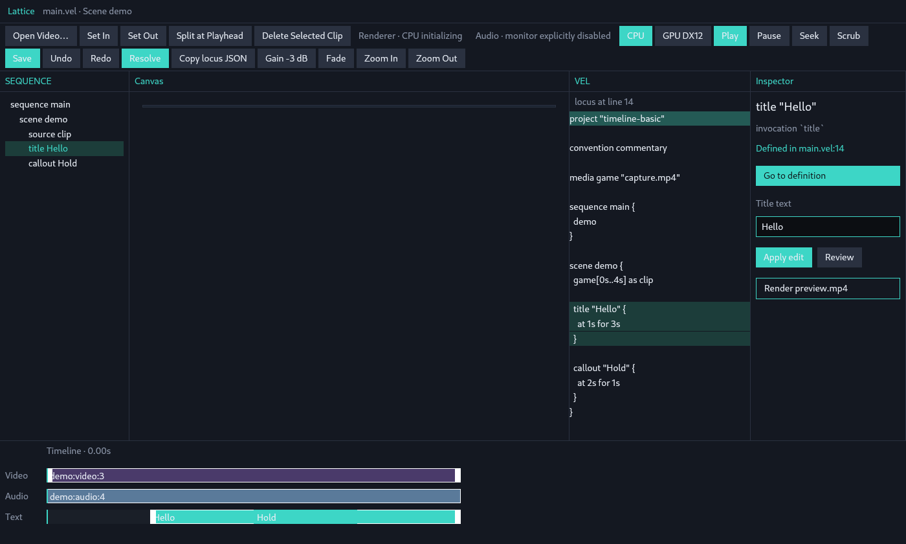

Documented smoke: Play (audio monitor disabled ⇒ `audio_no_windows`, so Play is allowed) → ruler scrub to ≥ half duration → Video clip click → SEQUENCE scene click.

Log:

```text
play … playing=true reason=play   locus still demo:title:1
gesture begin-scrub … playhead 0.80s → commit 3.200056s undo=0
  locus still demo:title:1   (3.20s is inside title 1s–4s)
Video click: Reorder moved=false → Clicked
  locus becomes scene:demo
SEQUENCE scene click: already scene:demo
```

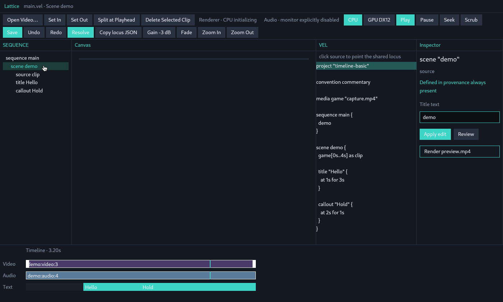

Video-clip body only (50% of the Video rail, inside the clip, away from the 8px edges): `Reorder` `moved=false` → `Clicked` → `point_scene` → `scene:demo`. Playhead stays `0s`. Inspector heading is `scene "demo"`; Title text is still `demo`.


Audio rail at 62.5% (2.5s) while locus was `scene:demo`: `Scrub` commit `2.500045s` **and** `point_from_timeline_time` → `demo:callout:2` / Hold (spec 4 beats the longer title). Inspector Title text is `Hold`.

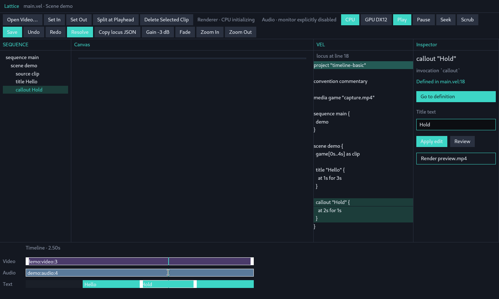

Scene locus + Apply edit with draft `demo` inserts a new title (working source only; disk fixture unchanged until Save):

```vel
title "demo" { at 0s for 3s }
```

SEQUENCE gains `title demo`. Text rail shows `demo` from 0s. Explainable as Engine `apply_title` → `insert_title` when the locus is Scene.

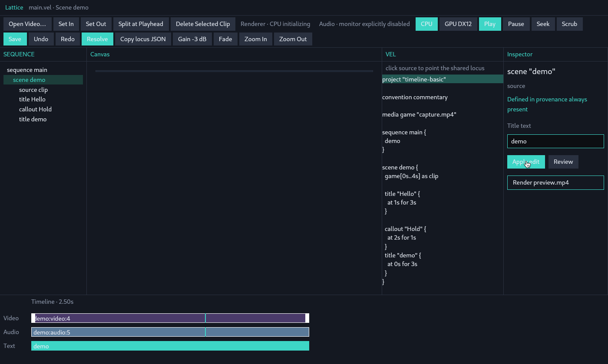

Trim chrome after the scene is current: white in/out bars on `demo:video:3`. Crop at playhead 2.50s so the left bar is not under the playhead.


After this, Inspector is `scene "demo"` with `Title text = demo` and no Go to definition. VEL may keep a leftover line highlight (scene has no `source_span` to project).

### B. Preview on (`observe-canvas` + `testsrc` MP4)

Open: CPU still of the colorbar at `0.00s`. Locus is still Hello. **No title overlay** (span starts at 1s).

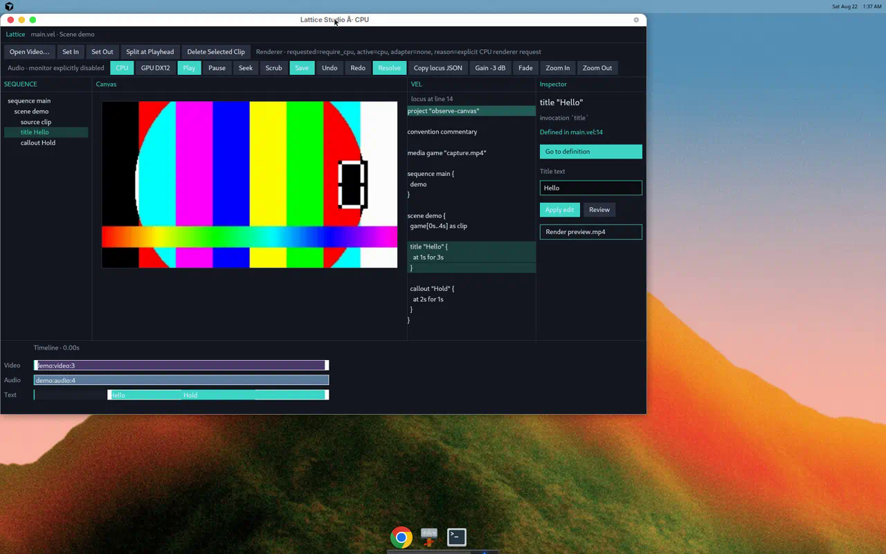

SEQUENCE `title Hello` → playhead `1s`, overlay appears, `canvas-drag` begin/update/commit `Applied`, Undo=1. Working VEL gained `position (9.38%, 81.11%)`. Disk file unchanged until Save.

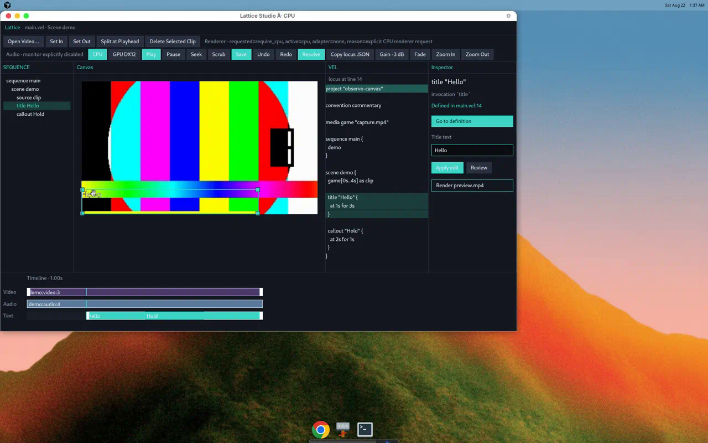

This session’s pointer log shows `canvas-drag` only. Four-corner handles painted; no `canvas-resize-*` commit was recorded.

SEQUENCE `callout Hold` → playhead `2s`, Inspector `callout "Hold"`, **Title text still shown** (`Hold`), Go to definition present.

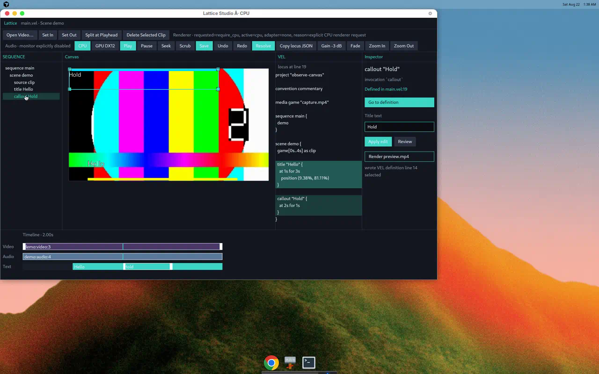

Text-track Hello click: `MoveOverlay` not moved → `Clicked`, locus `demo:title:1`, playhead **stays 2s**. Canvas still shows Hold (playhead in Hold) while Hello is selected and gets handles if its span also contains 2s.

Inspector Review on unchanged `"Hello"`:

```text
set title text 'Hello'
--- a/source.vel
+++ b/source.vel
@@ no line changes @@
```

Apply / Reject appear. Reject clears Review; source unchanged.

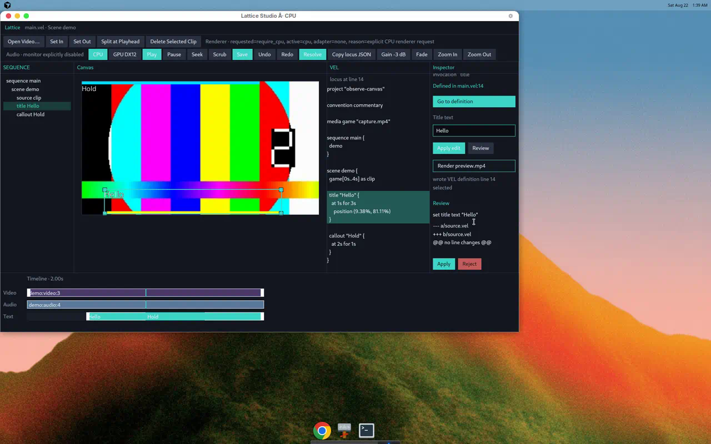

Seek → playhead `0.00s` (always `Time::ZERO`). Overlay gone.

Space → no `reason=play` in the log; playhead stays.

Open Video… (Linux, no `LATTICE_OPEN_VIDEO`): Inspector `wrote Open Video…: set LATTICE_OPEN_VIDEO to an MP4 path, or pick a file`. No picker (`open_video_path` returns `None` off Windows).

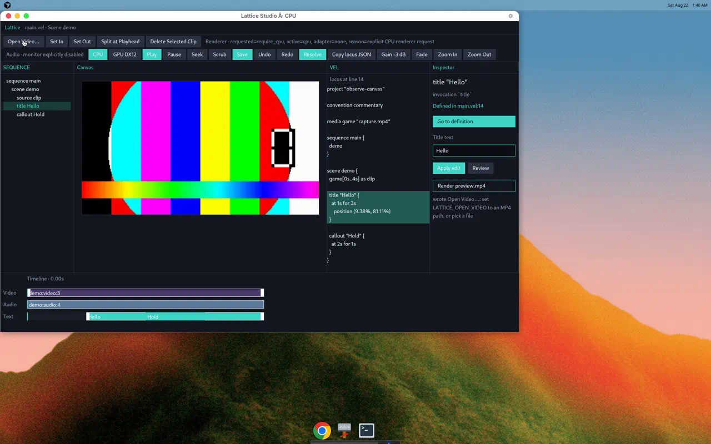

GPU DX12 → typed error, no CPU fallback. `preview_retry_required` blocks further extract until an explicit renderer click. Play is then blocked. GPU button stays visually selected.

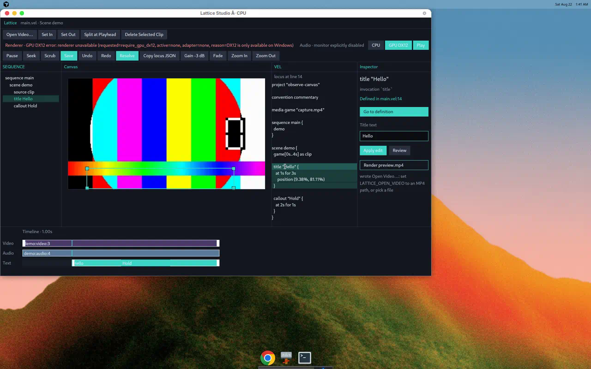

SEQUENCE `scene demo` after that: Inspector `scene "demo"`, `Defined in provenance always present`, Title text `demo`, no Go to definition. VEL highlight can remain on the previous title span.

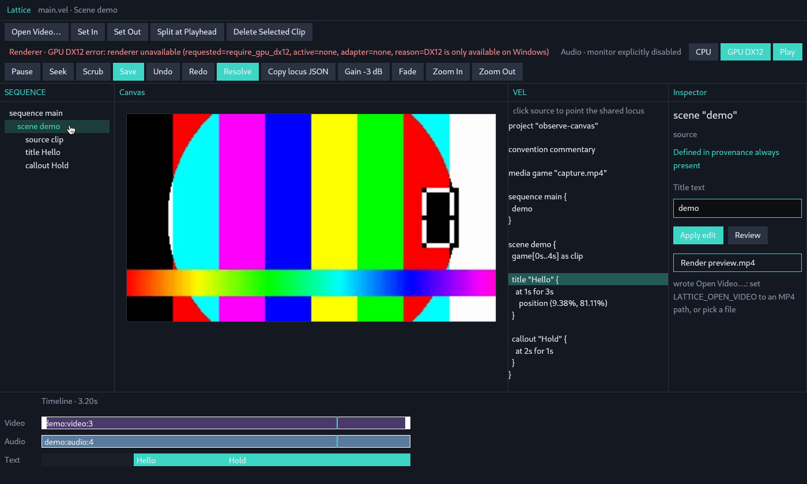

Audio-track click at ~80% from locus `scene:demo`: `Scrub` commit `3.20s` (title span, outside Hold 2s–3s) then `point_from_timeline_time` → `demo:title:1` / Hello.

```text
gesture begin track=Audio kind=Scrub  locus=scene:demo  playhead=3.20s
gesture commit outcome=Scrubbed      locus=demo:title:1 playhead=3.20s
```

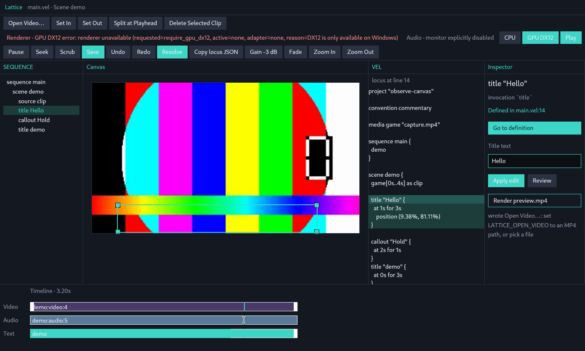

## Obvious friction

These are observed collisions, not a request for NLE chrome.

1. **Locus vs Canvas time.** Open: title is current, playhead `0s`, overlay hidden. Tree-click jumps time; VEL-click also jumps (`point_at` → `sync_playhead_to_current`). Text-clip click does **not** jump. User-visible “here” splits: Inspector/VEL/tree vs picture.
2. **Canvas chrome is gated on a still.** `LATTICE_STUDIO_PREVIEW=0` (the Linux smoke) cannot exercise move/resize. The empty Canvas is not a second editor; it is “no frame, therefore no overlay widgets”.
3. **Title field is global.** Scene/callout/source all show `Title text` + Apply/Review. Apply on a scene can `insert_title`. Apply on a callout retargets to the scene.
4. **Review can be a no-op proposal.** Same string → `@@ no line changes @@` plus Apply/Reject. Docs’ Review picture is not implemented.
5. **Scene has no source span.** Navigate is correctly optional — and for `scene demo` it is absent. Tree-click then leaves the previous VEL highlight in place.
6. **Scrubbing points.** Ruler and Audio rail commit `point_from_timeline_time`. Playhead motion is also “change here”. That is one locus, but it surprises if you thought you only moved time.
7. **Toolbar wrap.** Two rows; Play’s `smoke_geom` moves (`1115,67` → `396,102` → `1353,102`). Smoke has a CSD Y retry for Play only. `Seek` means start. `Scrub` calls `session.scrub(playhead)` (transport stop, same time).
8. **Space does nothing.** Play is a toolbar hit. After a DX12 error, even Play is blocked until CPU is clicked again.
9. **Header lies.** `header_bar` always appends `· Scene demo` regardless of sequence/scene.
10. **Window scroll is timeline scroll.** Control+wheel over VEL/Inspector still zooms the rail (`ui_driver` test targets `timeline.ruler` but the handler is root-wide).
11. **Trim is two-phase.** First body click selects (`Clicked`); handles then exist for a second gesture. Unselected clips have no trim hit.

## Easily testable alternatives

Existing oracles already cover most of these without Computer Use: `UiDriver` selectors, `StudioSession` APIs, `semantic_state` JSON.

| Alternative | How to test without inventing a second model |
|---|---|
| Space → Play/Pause (only if renderer/audio ready; same `start_play` / Pause path) | `UiDriver::press("space")` + `session.is_playing()` |
| Do not show Title/Apply/Review unless `LocusKind::Title` | Open fixture, `point_at` callout/scene, assert `inspector.title` absent or Apply is a no-op |
| Refuse Review when draft == current label | Click Review on Hello; assert `review_proposal()` is `None` or diff is not shown |
| Paint overlay chrome on an empty stage (still bound to `locus_id` + playhead span) | `PREVIEW=0` + `debug_selector("canvas.overlay.demo:title:1")` after seeking to 1s |
| On open, either leave locus unset or park playhead on the rebound title | `UiFixture::expected_initial` already pins `playhead=0s` + title locus — change the pin if the product choice changes |
| Scrub commit does not call `point_from_timeline_time` | Ruler drag; assert locus id unchanged |
| Audio rail stays scrub-only **and** does not retarget locus | Same |
| Hide or disable GPU DX12 off Windows; revert request on typed error | Click GPU on Linux; assert `renderer` stays `RequireCpu` and preview keeps extracting |
| Hide Open Video… when `open_video_path` cannot succeed | Linux click; button absent or disabled |
| Give scene a real `source_span` **or** clear VEL selection when Navigate is missing | Tree-click scene; assert no leftover title-line highlight |
| Seek labeled as start; remove identity `Scrub` button | Selector/label assertion |
| Enter in title field = Apply edit | `press("enter")` after `inspector.title` focus |
| `insert_title` from Inspector Apply on a scene is explicit (or forbidden) | Scene locus + Apply `"demo"`; assert source either unchanged or contains a new `title` with an explain event |

Do not add a parallel per-pane selection to “fix” (1) or (6). If Canvas and VEL disagree, the bug is projection (playhead vs span), not a missing second selection.

## Incomplete or dead interaction behavior

| Visible control / path | What actually happens |
|---|---|
| Toolbar `Scrub` | `session.scrub(current playhead)` — no x mapping, no Undo, no locus change |
| Toolbar `Seek` | Always `Time::ZERO` |
| Space | Unbound |
| `Open Video…` on Linux without `LATTICE_OPEN_VIDEO` | Status string only; `#[cfg(not(windows))]` picker is `None` |
| `GPU DX12` on Linux | Typed `DX12 is only available on Windows`; preview/play then require an explicit CPU retry |
| Canvas overlays with `LATTICE_STUDIO_PREVIEW=0` | Not created |
| Review “picture + VEL diff” (`docs/interaction.md`) | Diff + Apply/Reject only |
| Audio clip trim / move / gain-from-clip | Clips draw; pointer is scrub |
| SEQUENCE `freeze:…` row (`layout::tree_from_compilation`) | `selected: false`; id is not a real locus — `point_at` cannot inspect it |
| Four-corner resize in this live session | Handles visible; no resize commit in the log (move committed instead) |
| Inspector Apply/Review on non-title | Title edit / possible `insert_title` |
| VEL Up/Down, mouse-drag selection | Absent |
| Title Enter-to-apply | Absent |
| Agent instruction box | Intentionally absent (external agents + locus JSON) |
| Persistent history besides Git + volatile Undo | Absent (correct) |

`debug_selector` is a test-only no-op in the product binary. OS smoke must keep using `smoke_geom` + `_NET_WM_PID`.

## Invariant check (this observation)

- One `session.current: Option<LocusId>` is shared. Tree, canvas, timeline, VEL, Inspector, Review, and clipboard JSON all read it. No second selection store was found.
- GPUI types do not appear in `lattice-core` / Engine edit types. Canvas commit is `NormalizedPosition` / `NormalizedScale`.
- Preview/export consume flattened timeline + `evaluate_at`, not VEL, when extract is on. FFmpeg is decode/encode, not the compositor model.
- Working source is the project; Save writes the `.vel`. Undo is session stacks of source text.
- No LLM client in Studio.
- Failed VEL drafts and failed commits do not replace the compiled graph (`set_working_source` / `apply_committed` restore).
- Hidden behavior to watch: scrub-as-point, Apply-title-on-scene insert, playhead jump on `point_at`, overlay widgets missing without a still. Those are explainable from the symbols above; they are easy to misread as magic if you only watch the chrome.
