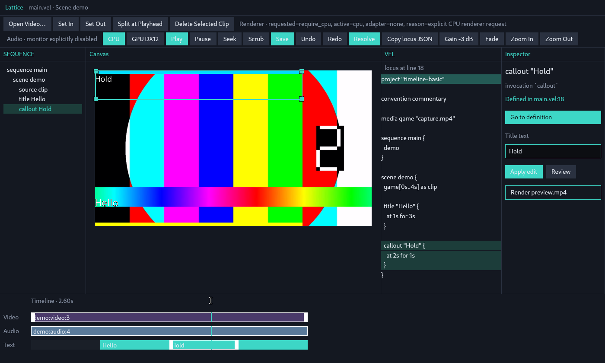
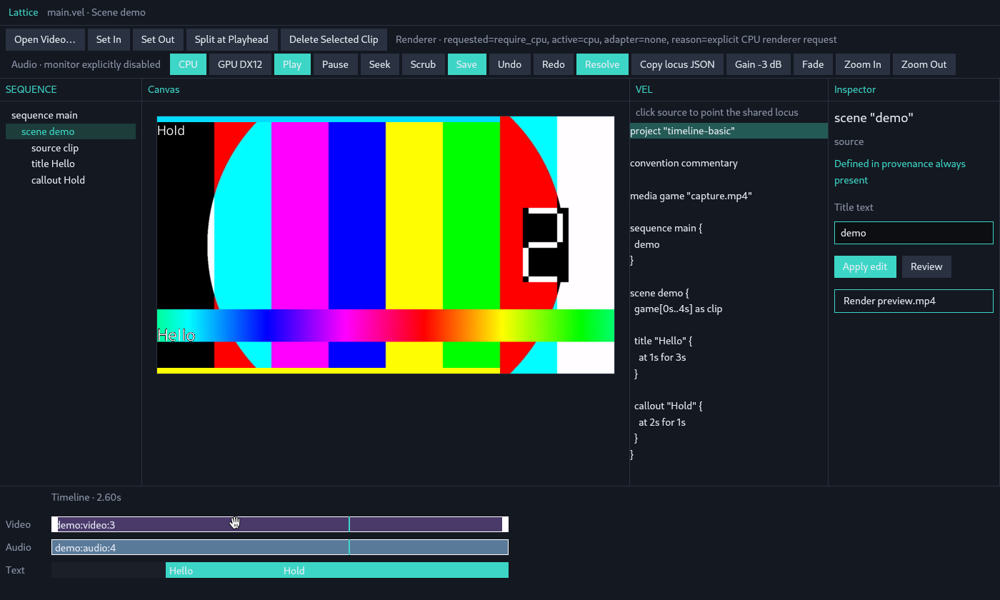
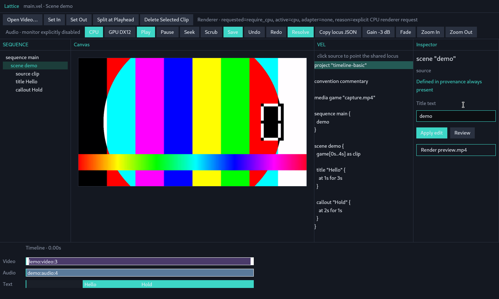
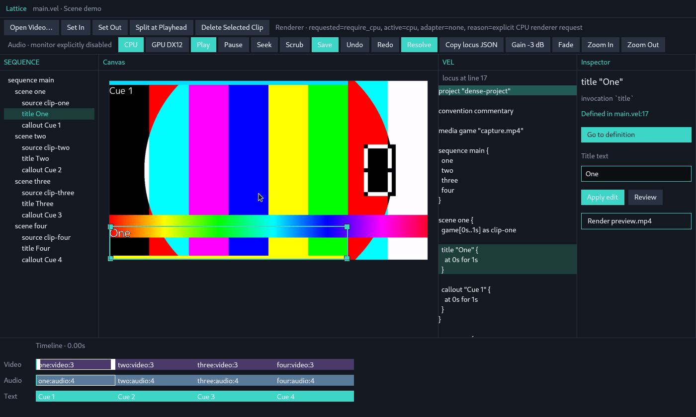
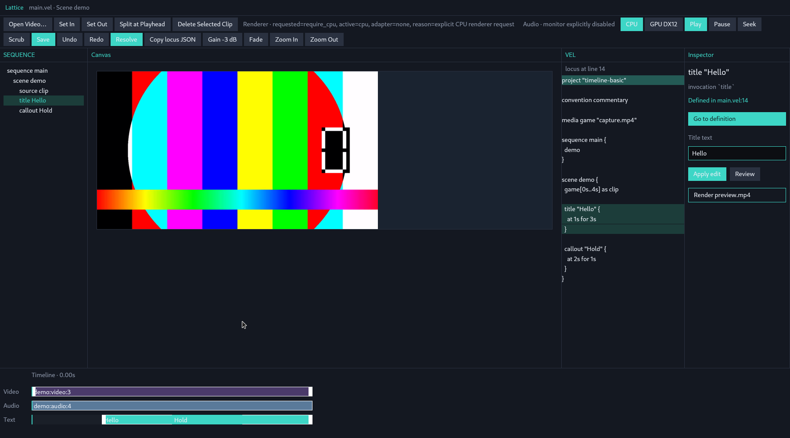
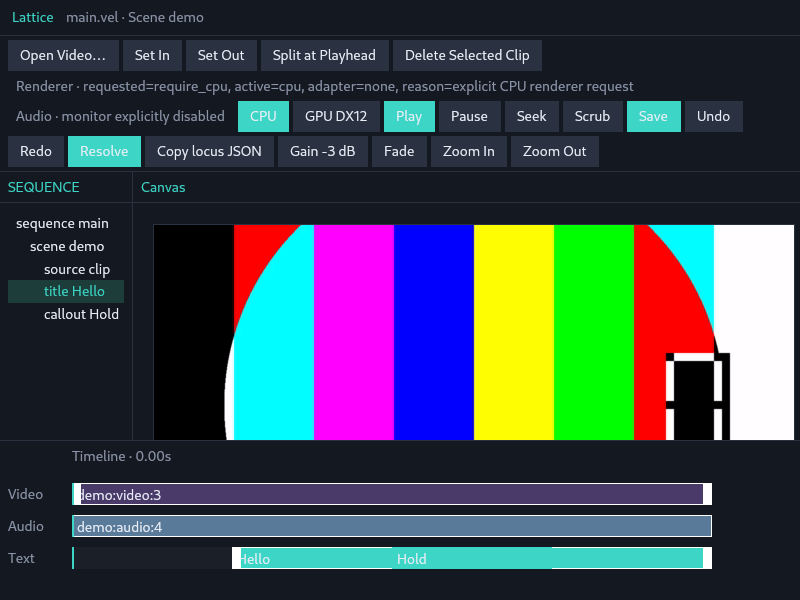
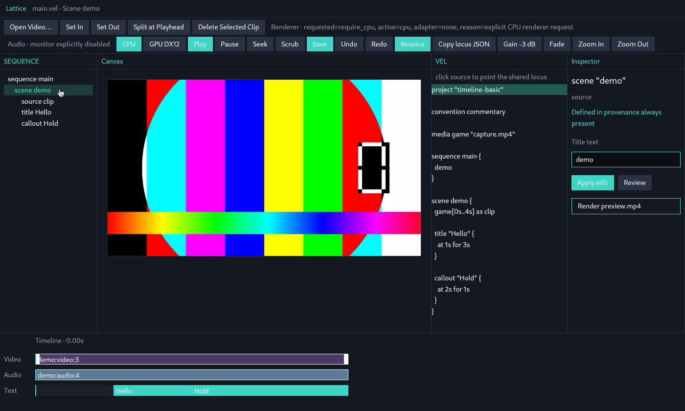
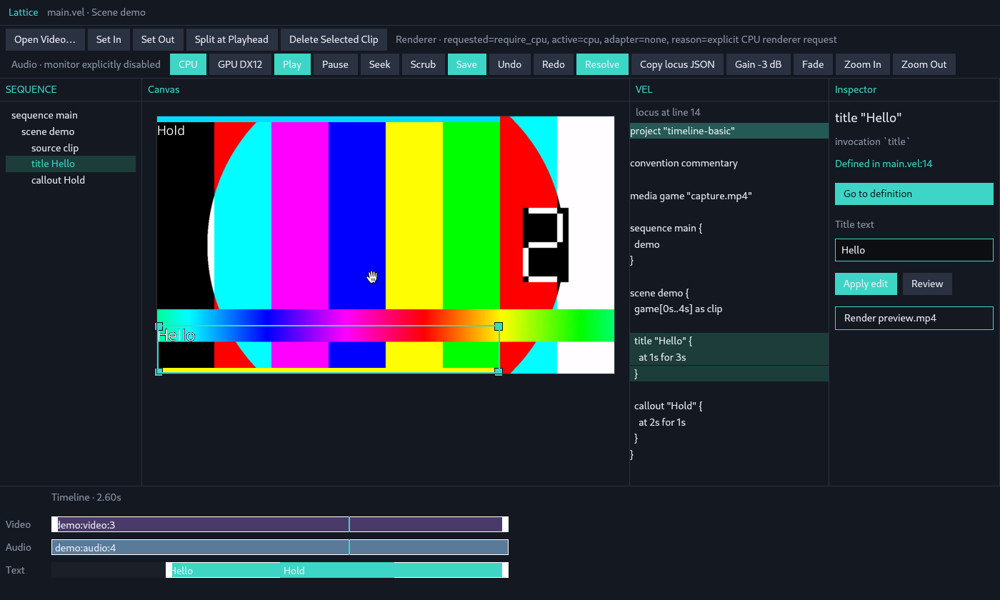
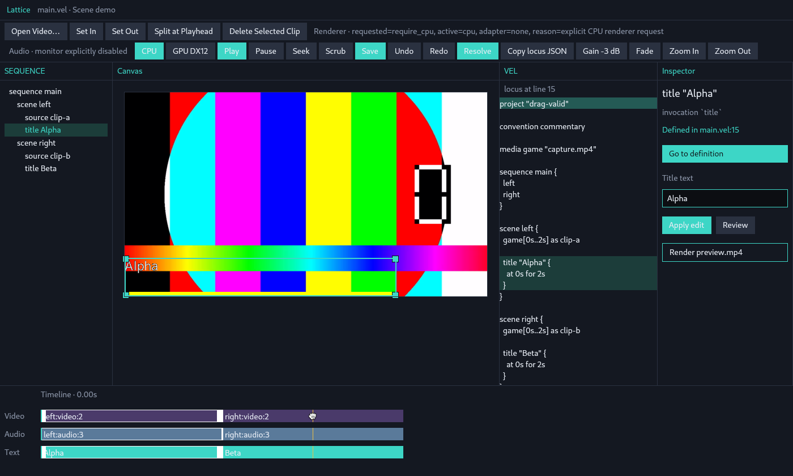

# Lattice Studio 視覚・知覚的探索レポート (Visual & Perceptual Exploration Report)

**探索対象リファレンス:** `annenpolka/lattice @ main` (commit: `60ce42f51ce64c3db05ce693b1605b249828038e` / PR #2 `feat/alpha-studio` マージ後)  
**探索者ロール:** Visual / Perceptual Explorer (観察レポート専用・UIコード変更なし)  
**観察環境:** Linux X11 (`DISPLAY=:1`, XFCE / Xfwm), GPUI 0.2 / Mesa Lavapipe CPU Renderer, 解像度 1400×840 / 1800×1000 / 1024×720 / 800×600  

---

## 1. 概要と探索アプローチ

本レポートは、Lattice Studio（Alpha / Milestone 0）のグラフィカルインターフェースを、ユーザーの視点から**ピクセル配置・レイアウト・視覚的アフォーダンス（知覚可能な手がかり）**に基づき探索・記録した観測レポートです。

従来のビデオ編集ソフト（Premiere / Resolve）、デザインツール（Figma）、コードエディタ（VS Code）の既存クロームを「あるべき姿」として前提とせず、Lattice が提示する**「共有 Locus（全ビューで同期する現在地）」「テキスト/DSL ファースト」「決定論的タイムライン」**という独自パラダイムが、実際の画面ピクセル上でどのようにユーザーに知覚され、どこに曖昧さや意図せぬ強調、空間的課題が生じているかを独立して報告します。

---

## 2. 視覚的証拠アーカイブ (Visual Artifacts)

本探索で取得した実画面スクリーンショット群（`docs/screenshots/` 配下にコミット）:

| ID | ファイル名 | 状態・シナリオ |
|:---|:---|:---|
| 01 | `01_overview_title_locus_selected.png` | 基本レイアウト全体像（Title Locus 選択中・Canvas プレビューあり） |
| 02 | `02_toolbar_hover_play.png` | ツールバー（Play ボタンへのマウスホバー状態） |
| 03 | `03_scene_locus_selected.png` | SEQUENCE ツリーで Scene Locus を選択した状態 |
| 04 | `04_inspector_title_editing.png` | Inspector 内での Title テキスト編集フォーカス状態 |
| 05 | `05_inspector_applied_edit.png` | Inspector 編集適用（Apply edit）後の画面同期 |
| 06 | `06_inspector_proposed_diff_review.png` | Review ボタンによる差分提案表示状態 |
| 07 | `07_timeline_scrub_in_flight.png` | タイムラインルーラーでのスクラブ（ドラッグ中） |
| 08 | `08_timeline_scrub_committed.png` | タイムラインスクラブ確定（Commit）後の状態 |
| 09 | `09_timeline_video_clip_selected.png` | Timeline Video クリップ選択状態（トリムハンドル表示） |
| 10 | `10_canvas_overlay_drag_in_flight.png` | Canvas 上でのオーバーレイ配置ドラッグ中 |
| 11 | `11_dense_project_multi_scene.png` | 高密度 4 シーン構成プロジェクト（Dense Project）全体像 |
| 12 | `12_dense_project_scene3_selected.png` | Dense Project での Scene 3 選択状態 |
| 13 | `13_drag_valid_overview.png` | 2 シーン構成（Drag Valid）初期状態 |
| 14 | `14_drag_valid_reorder_in_flight.png` | Timeline クリップ並び替え（Reorder）ドラッグ中 |
| 15 | `15_window_wide_1800x1000.png` | ワイド解像度（1800×1000）での空間配置 |
| 16 | `16_window_compact_1024x720.png` | コンパクト解像度（1024×720）での折り返し挙動 |
| 17 | `17_window_ultracompact_800x600.png` | 極小解像度（800×600）でのレイアウト崩壊とクリッピング |

---

## 3. 独立観測レポート

### A. 曖昧なアフォーダンス (Ambiguous Affordance)

ユーザーが画面上のピクセルを見たときに、「これが何であり、どのように作用するのか」が多義的または不透明に見える箇所です。

1. **ツールバー上の静的ステータスとアクションボタンの視覚的同質性**:
   - 最上部のツールバーにおいて、`Renderer · requested=...` や `Audio · monitor explicitly disabled` というテキスト表示が、左側の `Open Video…`, `Set In`, `Set Out` 等のアクションボタンと**全く同じ高さ・行・パディング・枠組み**の中に並んでいます。
   - 枠線の有無や背景色による明確なカテゴリ分離（「操作系ボタン」vs「情報表示ラベル」）がないため、ユーザーはこれらをクリック可能なボタンと誤認するか、あるいは逆に周囲のボタンを単なるラベルと見誤るリスクがあります。

2. **モード切り替えボタン（CPU / GPU DX12）のトグル性**:
   - `CPU` と `GPU DX12` は排他的選択（ラジオボタングループ）ですが、外見は単体の押しボタンと同じです。
   - 現在選択されている `CPU` がティール色ベタ塗り（`#3dd6c6`）になっていますが、これは「現在 CPU モードであることを示すインジケータ」なのか、「クリックすると CPU モードを起動するアクション」なのかの視覚的手がかりが曖昧です。

3. **タイムラインルーラーのスクラブ可能性の不可視性**:
   - 下部タイムライン上部には `Timeline · 0.00s` というテキスト領域があります（）。
   - ここには時間軸の目盛り（秒数のティックマークやグリッド線）や、再生ヘッドを掴むためのスライダーつまみ（Handle）が存在しません。
   - ピクセル情報としては「単なる現在時刻のラベル」に見えますが、実際にはこの帯全体がクリック・ドラッグでスクラブ可能なアクティブ領域です。操作可能なレールであることが視覚的に完全に隠蔽されています。

4. **タイムラインクリップのトリムハンドル**:
   - クリップを選択した際、クリップの左右端に 8px 幅の白い帯が出現します（）。
   - マウスを乗せるとカーソルが `ResizeLeftRight` に変化しますが、静止状態では単なる「選択枠のアクセント」や「境界線の装飾」に見え、これを掴んで左右に伸縮（Trim）できるという機械的アフォーダンス（グリップパターンや矢印アイコン等）がありません。

5. **SEQUENCE ツリーの操作アフォーダンス**:
   - 左端の `SEQUENCE` ペインに表示されるノード群は、インデントされたプレーンテキストのみで構成されています。
   - フォルダ/ファイルアイコンや、展開・折りたたみを示す三角マーク（ disclosure triangle ）、階層線が存在しないため、単なるフラットなリストに見え、階層関係やクリックして選択できる対象であることが直感的には伝わりにくい構造です。

---

### B. 偶発的・意図せぬ強調 (Accidental Emphasis)

デザイン上の優先度や重要度とは無関係に、特定の色やサイズが過剰に視線を集めてしまっている現象です。

1. **Teal (`#3dd6c6`) の過剰遍在と視覚的階層の飽和**:
   - Lattice Studio では、ブランドカラーである鮮やかなティール色（`#3dd6c6`）が、用途や重要度の異なる無数の要素に同時に、かつ同一の強度で適用されています：
     - **主要アクション**: `Play`, `Save`, `Resolve`, `Apply edit`
     - **トグル状態**: `CPU`
     - **定義ジャンプ**: `Go to definition`（巨大な長方形ボタン）
     - **テキストクリップ**: タイムラインの Text トラックの全クリップ背景
     - **再生ヘッド**: タイムラインを縦断する 2px の線
     - **キャンバス選択枠**: 選択されたオーバーレイの 2px 枠線と 4 隅のハンドル
     - **ペイン見出し**: `SEQUENCE`, `Canvas`, `VEL`, `Inspector`
   - この結果、画面全体に高輝度のティール色が散乱し、ユーザーの視線が「今どこに主眼があるのか」「最も重要な次の一手は何か」を判別できなくなっています。

2. **`Go to definition` ボタンの巨大な存在感**:
   - Inspector ペイン内において、`Go to definition` ボタンが横幅いっぱいのティール色ブロックとして描画されています。
   - このボタンは「VEL 内の定義行へジャンプする」という副次的なナビゲーション機能ですが、その下にある主作業領域（`Title text` 入力欄や `Apply edit` ボタン）よりも圧倒的に目立っており、知覚的な主従関係が逆転しています。

3. **Text トラッククリップと再生ヘッドのコントラスト消失**:
   - タイムライン上の Text トラックのクリップ背景色はティール色です。
   - 一方、再生ヘッドの縦線も同じティール色です。
   - 再生ヘッドが Text トラック上を通過する際、背景と線色が同一になるため、**Text トラックの領域だけ再生ヘッドが完全に消失したように見える**という偶発的マスキングが発生しています。

---

### C. 情報密度 (Information Density)

画面内の各領域における情報の密集度と余白の配分に関する観察です。

1. **中央 Canvas ペインの広大な低密度領域**:
   - 画面中央の Canvas ペインは画面全体の約 40〜50% の面積を占有しますが、16:9 のプレビュー映像以外は単調な暗色背景（`#1a2330`）の巨大な余白となっています。
   - 映像がロードされていない場合（またはプレビュー無効時）は、完全に真っ黒な空虚領域となり、ペイン全体が機能停止しているような印象を与えます。

2. **最上部ツールバーの極度な過密**:
   - 単一の横一行に、ファイル操作、編集コマンド、ステータス文字列、レンダラ選択、再生制御、履歴、メディア解決、音量、ズームなど、20 個近いコントロールが隙間なく詰め込まれています。
   - ウィンドウ幅が狭くなると `flex_wrap` によって複数行に折り返され、画面上部の専有面積が急激に膨張します。

3. **タイムラインの時間軸情報の希薄さ**:
   - トラック高さは各 22px、全体高さ 160px と非常にコンパクトに設計されています。
   - しかし、ルーラー上に時間グリッドや秒数ラベルが一切ないため、「4 秒のプロジェクトの中で現在クリップがどこにあり、何秒間続いているのか」という時間的な密度情報が視覚的にほぼ欠落しています。
   - クリップ内に表示される識別子（例: `demo:video:3`, `one:video:3`）は、クリップの幅が狭い場合（Dense Project 等）に枠をはみ出すか切り詰められます。

4. **VEL エディタの平坦なテキスト密度**:
   - 幅 280px の VEL ペインには構文ハイライト（Syntax Highlighting）が存在せず、キーワード、文字列、数値、ブロック構造がすべて同一の淡色テキストで表示されます。
   - 行ハイライト（Locus に応じた `#1c3d3a` のブロック）のみが強い情報コントラストを持ち、コード自体の情報密度は均一で平坦です。

---

### D. 空間的関係性 (Spatial Relationships)

画面を構成するペイン同士の幾何学的配置と、ウィンドウサイズ変更時の適応性です。

1. **4 カラム水平分割 + 下部ドッキング構造**:
   - 左から `SEQUENCE` (固定 200px) | `Canvas` (可変 `flex-1`) | `VEL` (固定 280px) | `Inspector` (固定 240px)
   - 下部に `Timeline` (固定 160px、レール幅 `TIMELINE_WIDTH = 640px` 固定)
   - 上部に `actions_bar` (ツールバー)

2. **ワイド画面（1800×1000）での空間的挙動**:
   - ウィンドウを拡大すると、固定幅ペイン（SEQUENCE, VEL, Inspector, Timeline レール）は一切拡大せず、**中央の Canvas ペインの余白のみが横方向に拡大**します。
   - タイムラインのレール幅（640px）が画面左側に寄ったまま固定されているため、画面右下に広大な未使用の暗黒空間が残され、視覚的な重心が左に偏ります。

3. **極小画面（800×600）での壊滅的なレイアウト破綻**:
   - ウィンドウを 800×600 に縮小すると、以下の現象が連鎖します：
     1. ツールバーが 4 行に折り返され、画面上部を大きく占有。
     2. メイン領域が下に押し下げられる。
     3. 固定幅ペイン（SEQUENCE 200px + Canvas + VEL 280px + Inspector 240px = 720px + α）が画面幅 800px に収まりきらず、**右側の `VEL` ペインと `Inspector` ペインが画面外（右側）に完全に押し出されて見えなくなる**。
     4. ユーザーはコードを見ることも、インスペクタを操作することもできなくなります。

---

### E. 何が接続・連動して見えるか (What Appears Connected)

ビュー間での状態の同期と、視覚的なつながりの知覚です。

1. **共有 Locus による 5 領域の多重同期（Lattice の核となる接続性）**:
   - SEQUENCE で `title Hello` をクリックすると、以下の 5 つの視覚変化が瞬時に同期して発生します：
     - ① **SEQUENCE**: `title Hello` 行が薄いティール色（`#1c3d3a`）でハイライト。
     - ② **Canvas**: プレビュー画面内の `Hello` テキストにティール色の 2px 枠線と 4 隅の正方形リサイズハンドルが出現。
     - ③ **VEL**: コードエディタ内の `title "Hello" { at 1s for 3s }` の 3 行が薄いティール色（`#1c3d3a`）でハイライト。
     - ④ **Inspector**: ヘッダーが `title "Hello"` に切り替わり、メタデータと `Title text` 入力欄が表示。
     - ⑤ **Timeline**: Text トラックの `Hello` クリップが白い 1px 外枠（`#ffffff`）で囲まれる。
   - この 5 面同時の状態同期は、Lattice の設計思想である「全ペインが共通の Locus（現在地）を覗くプロジェクションである」という概念をユーザーに極めて強く直感させます。

2. **知覚的断絶（接続が切れて見える部分）**:
   - 同期は完璧に行われているものの、**選択ハイライトの表現手法がペインごとに不統一**です：
     - SEQUENCE & VEL: 背景ブロックのティール塗り（`#1c3d3a`）
     - Canvas: ティール色の外枠線（`#3dd6c6`）+ ハンドル
     - Timeline: 白い外枠線（`#ffffff`）
     - Inspector: テキスト内容の切り替え
   - 特にタイムライン上の「白枠」は、他ペインの「ティール色ハイライト」と視覚言語が一致していないため、「同じ選択状態である」と脳が統合して認識するまでに一瞬の認知ギャップが生じます。

---

### F. クリック・ドラッグ可能に見えるもの vs 見えないもの

ピクセルから判断される操作可能性（アフォーダンス）と、実際の動作の対比です。

| 画面要素 | ピクセル上の見た目 | 実際のアクション | 知覚とのギャップ |
|:---|:---|:---|:---|
| **ツールバーボタン** | 角丸枠線またはベタ塗り四角形 | クリック可能（各種アクション） | **一致**（明確にボタンに見え、ボタンとして動く） |
| **ツールバーステータス** | 枠線なしテキスト（ボタンと同じ行） | クリック不可（情報表示） | **不一致**（ボタンの列に混ざっており紛らわしい） |
| **SEQUENCE ツリー行** | 単なるインデントされたテキスト | クリック可能（Locus 遷移） | **隠蔽**（リンクや行ボタンの見た目がないがクリック可能） |
| **VEL エディタ行** | 通常のコードエディタテキスト | クリック可能（Locus 遷移） | **隠蔽**（テキスト選択のつもりでクリックすると Locus が飛ぶ） |
| **Inspector ボタン群** | ティール色ベタ塗り / 枠線ボタン | クリック可能（適用 / 差分 / レンダリング） | **一致**（明確に押せそうに見える） |
| **Canvas オーバーレイ本体** | テキスト周囲のティール枠線 | ドラッグ可能（位置移動） | **中立**（枠線内部を掴めば移動できるが、中心グリップ等の表示はない） |
| **Canvas 4 隅の角** | 白枠付きのティール色 12px 正方形 | ドラッグ可能（アスペクト比保持リサイズ） | **一致**（明確にハンドルに見え、カーソルも変化する） |
| **タイムラインルーラー** | 「Timeline · 0.00s」というテキスト行 | クリック / ドラッグ可能（スクラブ） | **完全隠蔽**（目盛りやつまみがなく、操作可能に見えない） |
| **タイムラインクリップ** | 色付きの長方形 | クリック（選択）/ ドラッグ（並び替え） | **部分隠蔽**（クリック可能には見えるが、ドラッグで並び替えられる手がかりが乏しい） |
| **クリップ端の白帯** | クリップ選択時に現れる 8px の白い帯 | ドラッグ可能（トリム伸縮） | **部分隠蔽**（静止画では選択装飾に見え、ホバーカーソルで初めてトリムと分かる） |

---

## 4. 総括（Explorer's Summary）

Lattice Studio は、**「Locus（共有現在地）」を中心とする複数ビュー（ツリー・キャンバス・コード・プロパティ・時間軸）の同時同期**という強力で斬新な視覚体験を実現しています。1 つのノードをクリックするだけで、コードエディタ、インスペクタ、キャンバスオーバーレイ、タイムラインが手品のように連動する挙動は、製品のコアバリューを明確に伝達しています。

一方で、現状の視覚デザインには以下の主要な知覚的課題が観察されました：

1. **色彩階層の平坦化（Teal の過剰使用）**:
   - アクション、トグル状態、選択枠、テキストクリップ、再生ヘッド、見出しがすべて同じティール色で競合し、主役と脇役の視覚的ヒエラルキーが損なわれている。
2. **操作アフォーダンスの不可視性（ステルスな操作性）**:
   - タイムラインルーラーの目盛り欠落、クリップのドラッグ/トリムの視覚サイン不足、ツリーのテキスト平坦性など、「実は操作できるが操作可能に見えない」要素が多い。
3. **レスポンシブ配置の脆弱性**:
   - 固定幅（特にタイムラインの 640px レールやサイドバー群）とツールバーの `flex_wrap` により、コンパクトウィンドウ（1024px 以下）で重要ペイン（VEL / Inspector）が画面外に消失し、ワイド画面（1800px 以上）ではキャンバス以外の余白が無駄に余る。

本レポートは観測事実の提示を目的としており、UI コードの変更は行っていません。今後の Studio UI 洗練に向けた客観的ベースラインとして本記録を提供します。
