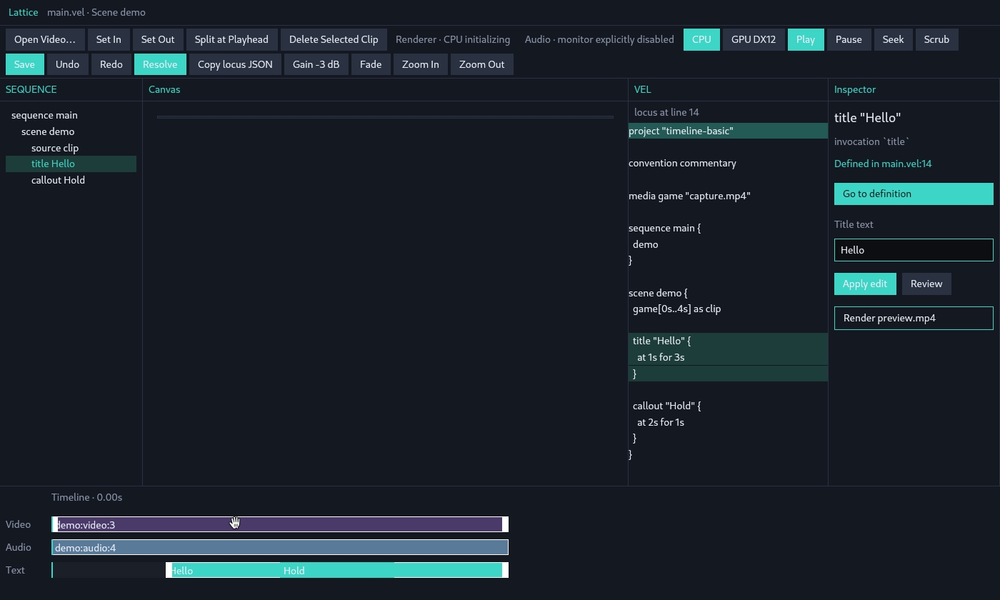
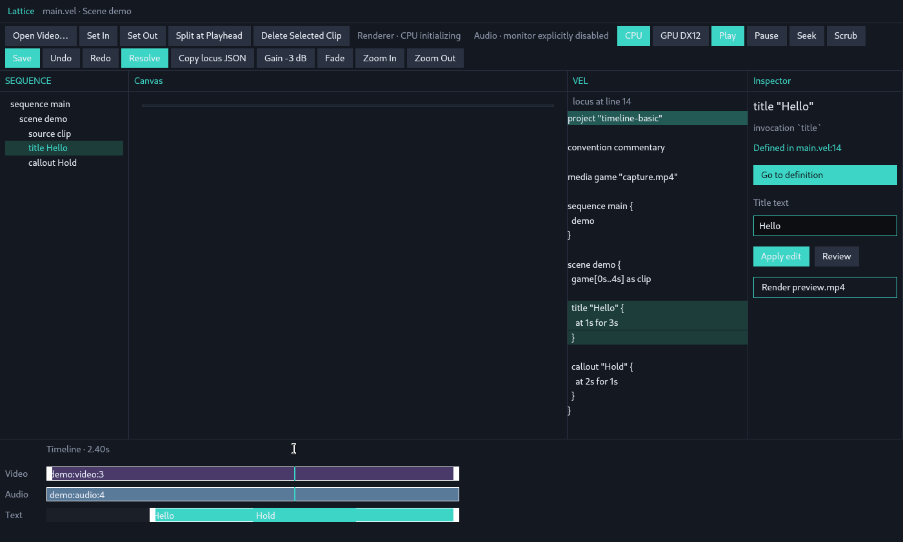
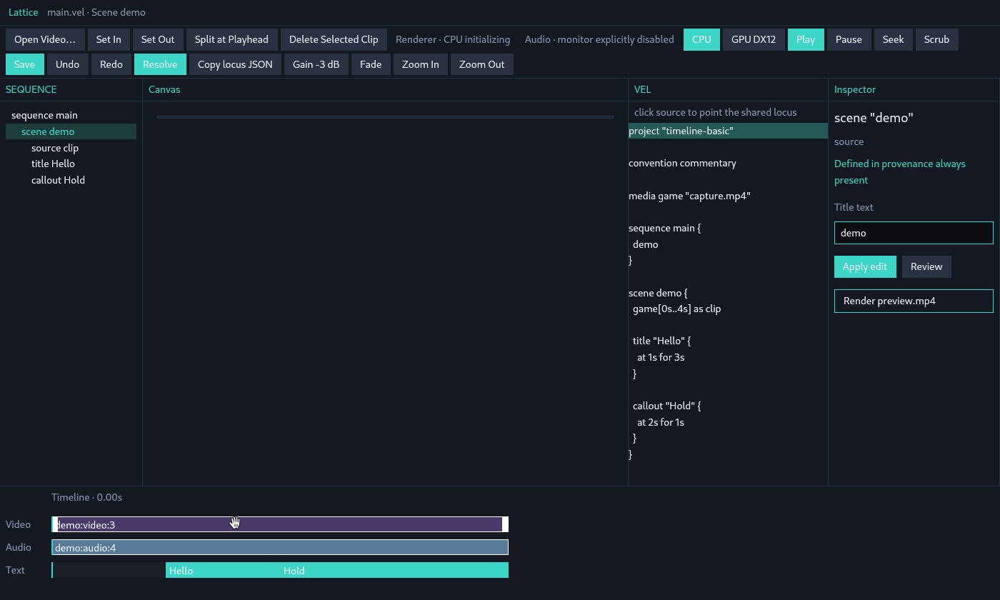
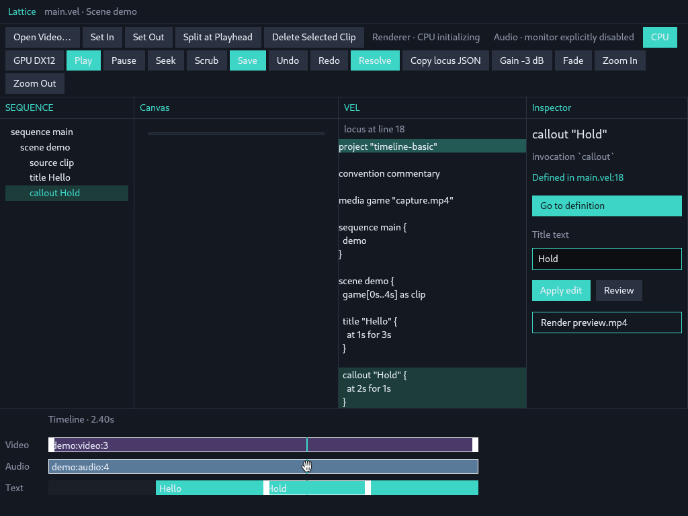
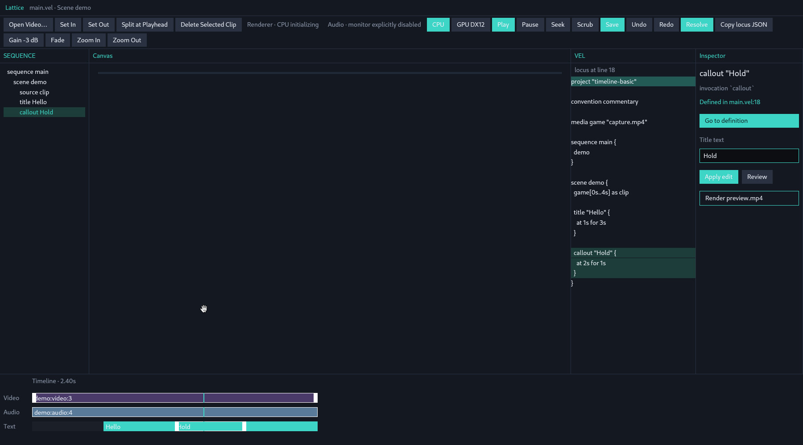
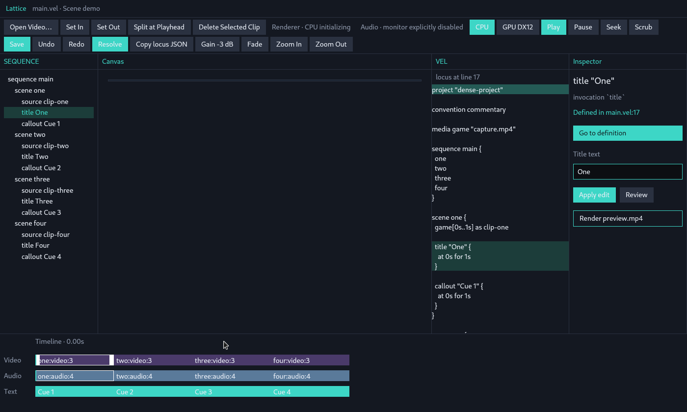
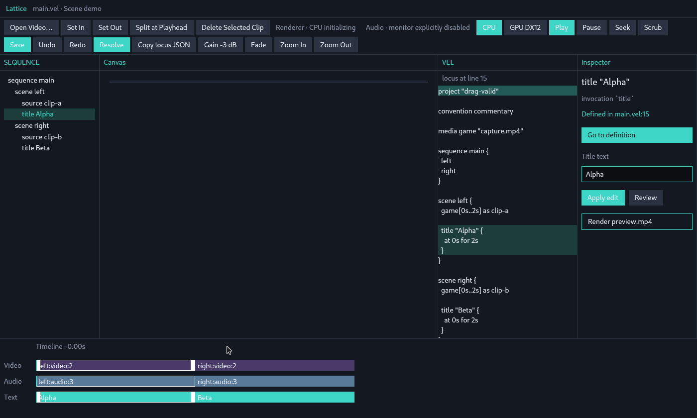

# Lattice Studio 視覚的・知覚的探索レポート (Visual Exploration Report)

本レポートは、`annenpolka/lattice` リポジトリ（`main` ブランチ、PR #2 `feat/alpha-studio` マージ済 HEAD）における Lattice Studio GUI の実際の描画画面に対する視覚的・知覚的観察レポートです。

UIのコード変更や「あるべきエディタの提案」は行わず、画面上に実際に現れている視覚的階層、グルーピング、発見可能性、主要に見える要素、編集可能に見える要素、選択状態の表現について、客観的な情報アーキテクチャの視点から独立して記述します。

---

## 1. 取得スクリーンショット一覧

Lattice Studio（GPUI / Vulkan lavapipe CPUレンダラー環境、X11 DISPLAY=:1）を実際に起動し、以下の複数の状態およびウィンドウサイズでキャプチャを行いました。

| ファイル名 | 状態 / フィクスチャ | 解像度 | 概要 |
|---|---|---|---|
| `docs/screenshots/01_default_layout_1400x840.png` | Default Layout (`timeline-basic`) | 1400×840 | 初期起動時の全体レイアウト |
| `docs/screenshots/02_hover_action_button.png` | Hover on Actions Bar | 1400×840 | アクションバーボタンホバー時 |
| `docs/screenshots/03_hover_timeline_clip.png` | Hover on Timeline | 1400×840 | タイムラインクリップホバー時 |
| `docs/screenshots/04_selected_timeline_clip.png` | Selected Timeline Clip | 1400×840 | タイムライン上のクリップ選択時 |
| `docs/screenshots/05_selected_tree_scene.png` | Selected Tree Scene | 1400×840 | SEQUENCEツリーのScene選択時 |
| `docs/screenshots/06_selected_tree_title.png` | Selected Tree Title | 1400×840 | SEQUENCEツリーのTitle選択時 |
| `docs/screenshots/07_drag_scrub_ruler.png` | Drag / Scrub Ruler | 1400×840 | タイムラインルーラーのドラッグ中 |
| `docs/screenshots/08_window_compact_1024x768.png` | Compact Window Size | 1024×768 | 狭いウィンドウでの折り返し・レイアウト |
| `docs/screenshots/09_window_wide_1800x1000.png` | Wide Window Size | 1800×1000 | 広いウィンドウでの余白・展開レイアウト |
| `docs/screenshots/10_dense_project_layout.png` | `dense-project` Fixture | 1400×840 | 4シーン・多要素構成でのレイアウト |
| `docs/screenshots/11_drag_valid_layout.png` | `drag-valid` Fixture | 1400×840 | 2シーン構成でのレイアウト |

---

## 2. 視覚的・知覚的観察分析

### 2.1 視覚的階層 (Visual Hierarchy)

1. **明度と彩度のコントラストによる階層**:
   - 全体はダークテーマ（暗い藍色／チャコールブラック `#10141b` 〜 `#161c24`）で統一されており、UIの枠組みは低コントラストで後退して見えます。
   - その中で、高彩度・高明度のソリッドティール色（`#3dd6c6`）の塗りつぶしボタン（`Play`, `Save`, `Resolve`, `CPU`, `Go to definition`, `Apply edit`）が極めて強い視覚的重み（アテンション）を持っています。
   - 一方、同じアクションバー内に並ぶ他のボタン（`Open Video…`, `Set In`, `Set Out`, `Split at Playhead`, `Delete Selected Clip`, `Undo`, `Redo`, `Gain -3 dB` など）は、暗いグレー背景に白い枠線のゴーストボタンスタイルであるため、ソリッドティールボタンとの間に強いコントラスト差が生じています。
2. **空間構造とペイン階層**:
   - **最上段**: タイトルバー（`Lattice  main.vel · Scene demo`）およびアクションバー（2段または3段のボタングリッド）。
   - **中段（メインエリア）**: 4つの垂直カラム分割。
     - 左カラム: `SEQUENCE`（幅固定 約200px、ツリー構造）
     - 中央左カラム: `Canvas`（可変幅、黒い矩形ステージ）
     - 中央右カラム: `VEL`（可変幅、テキスト／コード表示）
     - 右カラム: `Inspector`（幅固定 約240px、プロパティと操作ボタン）
   - **最下段**: 水平に広がる `Timeline`（時間軸ルーラーと複数トラック）。
3. **視線の誘導経路**:
   - 画面を開いた瞬間、視線はまず「上部の鮮やかなティールボタン（`Play` / `Save` / `Resolve`）」に引きつけられ、次に中段の巨大な暗黒領域（`Canvas`）と右側の明るいティールボタン（`Go to definition` / `Apply edit`）、そして下段のカラフルなタイムライン帯（紫・青・ティール）へと移動します。

---

### 2.2 グルーピング (Grouping)

1. **空間的分離によるグルーピング**:
   - 4つのメインペイン（`SEQUENCE`, `Canvas`, `VEL`, `Inspector`）は、細いグレーの境界線で垂直に整然と区切られています。各ペイン上部にはティール色の大文字ラベルが配置されており、それぞれの領域の境界が明確に分かります。
2. **ツールバーにおける混在と過密**:
   - 上部のアクションバーには、以下の異なる目的の要素が一列／二列のグリッドに並列して配置されています：
     - クリップ編集系: `Open Video…`, `Set In`, `Set Out`, `Split at Playhead`, `Delete Selected Clip`
     - エンジン／状態表示: `Renderer · CPU initializing`, `Audio · monitor explicitly disabled`
     - レンダラー切り替え: `CPU`, `GPU DX12`
     - トランスポート系: `Play`, `Pause`, `Seek`, `Scrub`
     - ファイル・履歴系: `Save`, `Undo`, `Redo`, `Resolve`, `Copy locus JSON`
     - オーディオ・ズーム系: `Gain -3 dB`, `Fade`, `Zoom In`, `Zoom Out`
   - これらにグループごとの視覚的境界線や空白セパレータがないため、視覚的には「均質なボタンの並び」として知覚され、機能ごとの意味的まとまりが把握しにくい状態です。
3. **色彩による共鳴（クロスグルーピング・連動）**:
   - 選択された要素（例：`title Hello`）に対応して、以下の4箇所が同時にティール系の背景ハイライト／線で着色されます：
     - `SEQUENCE` ツリーの `title Hello` 行
     - `VEL` エディタ内の `title "Hello" { at 1s for 3s }` ブロック
     - `Timeline` の `Text` トラックの `Hello` クリップ
     - `Inspector` のタイトル `title "Hello"` および入力欄
   - これにより、離れたペイン間に存在する同一コンテキストの「共鳴（連動）」が視覚的に強くグルーピングされます。

---

### 2.3 発見可能性 (Discoverability)

1. **発見しやすい要素**:
   - **ボタン類**: 明確な矩形枠や背景塗りがあり、クリック可能なコントロールであることが一目で分かります。
   - **タイムラインのトラック・クリップ**: 紫（Video）、青（Audio）、ティール（Text）で色分けされており、角丸や余白によって独立した「触れるオブジェクト」として直感的に認識できます。
   - **Inspector の入力フィールド**: `Title text` の下にある枠線付きの入力ボックス（`Hello` など）は、フォーム入力欄として容易に発見できます。
2. **発見しにくい / 手がかりが少ない要素**:
   - **Canvas（プレビュー未ロード時）**: プレビュー画像がない場合、単なる黒い長方形として表示されます。キャンバス上のオーバーレイやリサイズハンドル、ドラッグ可能領域が存在するのか、どう操作できるのかの手がかりが画面上に提示されません。
   - **Timeline ルーラーのスクラブ操作**: `Timeline · 0.00s` というテキスト表示はあるものの、目盛り（ティックマーク）やスライダーつまみが画面上に描かれていません。マウスを乗せるとカーソルが `I-Beam` / `Scrub` に変わることで初めてドラッグ可能であることが判明します。
   - **VEL ペインのインタラクティビティ**: コードビューアのように見えますが、行をクリックするとコンテキストが切り替わる機能や、直接テキスト編集できるかどうかが、上部の控えめな注記（`click source to point the shared locus`）以外からは直感的に伝わりにくい外観です。

---

### 2.4 何が主要に見えるか (What Appears Primary)

1. **画面の主役（Primary Focus）**:
   - **ソリッドティールのアクションボタン**: `Play` と `Save` が最も明るく、アプリの主要なコール・トゥ・アクション（CTA）として突出しています。
   - **Canvas ペイン**: 画面中央で最も広い面積（全体の約35〜45%）を占めており、物理的なレイアウト上の「主役」として配置されています。
   - **Timeline トラック**: 最下部で鮮やかな色彩（紫・青・緑）を持ち、時間軸におけるコンポジション全体を表現する主要な視覚アンカーとなっています。
2. **副次的な要素（Secondary）**:
   - `SEQUENCE` ツリーと `VEL` エディタ、`Inspector` は、暗いトーンと控えめな文字サイズで構成され、詳細確認や微調整を行うための補助ペインとして知覚されます。

---

### 2.5 何が編集可能に見えるか (What Appears Editable)

1. **編集可能と知覚される要素**:
   - **Inspector の `Title text` フィールド**: 明確な境界線を持つ黒背景の入力ボックスであり、テキストキャレットを受け入れて文字編集できるフォームであることが明確です。
   - **Inspector の `Apply edit` ボタン**: 入力欄の直下に配置されたティールボタンであり、「編集を適用する」アクションとして直感的に結びついています。
   - **Timeline クリップ**: 左右端に白い垂直線（トリム境界）があり、ホバー時にカーソルが変化するため、クリップの長さ変更や位置のドラッグが可能であると認識されます。
2. **編集可能か判断がつきにくい要素**:
   - **VEL ペイン内のソーステキスト**: シンタックスハイライト風に着色されていますが、行番号やエディタキャレット（点滅バー）、スクロールバーがないため、「編集可能なコードエディタ」なのか「静的なコード表示（プレビュー）」なのかが視覚的に曖昧です。
   - **SEQUENCE ツリーの項目**: 単なるテキストのインデントリストに見え、ドラッグによる並び替えハンドルやフォルダ開閉アイコンがないため、静的な目次（ジャンプリンク）のように見えます。

---

### 2.6 何が選択状態に見えるか (What Appears Selected)

1. **ツリーでの選択表現**:
   - 選択されたアイテム（例：`scene demo` や `title Hello`）の背景全体が暗い緑色（`#1b433e`）の帯で塗りつぶされます。
2. **ソースコードでの選択表現**:
   - 該当する宣言ブロック（例：`title "Hello" { at 1s for 3s }`）の複数行が同じ暗い緑色で帯状にハイライトされます。また、ファイル先頭行（`project "timeline-basic"`）も常に上部ハイライトとして表示されています。
3. **タイムラインでの選択表現**:
   - 選択されたトラッククリップの周囲に**白い外枠線（境界ハイライト）**が描画されます（例：`demo:video:3` や `demo:audio:4` の周囲に白い枠が付き、非選択クリップと区別されます）。
4. **インスペクタでの選択表現**:
   - インスペクタ最上部に、選択中の要素名（`title "Hello"` または `scene "demo"`）が大見出しとして表示され、関連プロパティが展開されます。
5. **タイトルバーの連動**:
   - 最上部タイトルバーに `Lattice  main.vel · Scene demo` のように、現在アクティブなコンテキスト名が追記されます。

---

## 3. ウィンドウサイズ変更時のレイアウト適応

### 3.1 コンパクトサイズ (1024×768)

- **ツールバーの3段折り返し**:
  - ウィンドウ幅が狭くなると、上部のアクションバーが3行に折り返されます。
  - これにより、`Play` ボタンや `Save` ボタンが2行目以降に回り込み、中段のメイン作業領域（ペインの高さ）が垂直方向に圧迫されます。
- **ペイン幅の圧縮**:
  - `SEQUENCE`（200px）と `Inspector`（240px）が固定幅であるため、中央の `Canvas` と `VEL` の幅が大幅に縮小します。
  - `VEL` 内のコード行が右端で窮屈になり、長い文字列が視界から隠れやすくなります。

### 3.2 ワイドサイズ (1800×1000)

- **ツールバーの1行整列**:
  - アクションバーの全ボタンが横1行に収まり、右側に適度な余白が生まれます。
- **Canvas と VEL の展開**:
  - 中央の `Canvas` 領域が横方向に大きく広がり、ステージとしての存在感が増します。
  - `VEL` エディタも十分な横幅が確保され、コードの可読性が向上します。
  - タイムラインも横に伸び、クリップ間の時間比率がより直感的に把握しやすくなります。

---

## 4. フィクスチャによる視覚的バリエーション

### 4.1 `dense-project` (高密度プロジェクト)

- 4つのシーン（`one`, `two`, `three`, `four`）とそれぞれの `title`, `callout` が存在。
- `SEQUENCE` ツリーが縦に長く伸び、タイムライン上にも 4 つのクリップが連続して水平に並びます。
- タイムライン上の各クリップの幅が狭まるため、ラベル文字（`one:video:3` 等）とクリップ境界の視認性が重要になります。

### 4.2 `drag-valid` (ドラッグ検証プロジェクト)

- 2つのシーン（`left`, `right`）で構成され、タイムライン上には左右対称のクリップペアが配置されています。
- シーン間の境界（白線）が明確に現れ、タイムライン上でのクリップの並び順が分かりやすく提示されています。

---

## 5. まとめ

Lattice Studio の画面は、ダークトーンの背景に対して**高輝度ティール色のアクセント**と**鮮やかなタイムライントラック色**を用いて、主要な操作ポイントと時間軸構造を提示しています。

特に、**SEQUENCEツリー・VELソース・Timelineクリップ・Inspector**の間で選択状態（ハイライト色および枠線）が連動する表現は、複数の表現形式（ツリー、コード、タイムライン、プロパティ）が1つの共通コンテキストに結びついていることを直感的に伝えています。
一方で、アクションバー内のボタン群の均一な並びや、プレビュー未ロード時のCanvas領域のアフォーダンス、VELペインの編集可否の判別など、視覚的手がかりの強弱に明確なコントラストが存在していることが観察されました。
